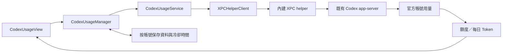

# Boring Notch 程式碼導覽與修改索引

本文件保存本次閱讀 repo 的架構與定位結果，供後續修改功能時快速查找相關程式碼。

同步原作者更新、GitHub Desktop 操作與分支合併流程，另見 [FORK_SYNC_GUIDE.md](FORK_SYNC_GUIDE.md)（含流程圖）。

本次需求、討論、進度與回覆的完整文字紀錄，另見 [CONVERSATION_LOG.md](CONVERSATION_LOG.md)。

- 整理日期：2026-10-03。
- 閱讀基準：commit `d58240c`，專案設定版本 `2.7.3`、build `271`；已補入 2026-10-03 的音樂首頁、月曆、Swift 6 遷移、天氣頁與 Codex 用量頁修改（見第 5、8、14、15、16 節）。前四項功能已包含於 `06a8061`，第 16 節為其後新增。
- 當時規模：123 個 Swift 檔案，約 19,600 行，包含主 App 與 XPC helper。
- 初次導覽以靜態閱讀為主；月曆修改另通過 Xcode Debug build、日期邏輯檢查與元件渲染檢查，詳見第 8 節。未啟動完整 App 驗證實際 EventKit 資料與滑鼠互動。此文件不是完整 bug audit。
- 修正前的 warning 分類、數量與定位保留在第 13 節；修正後已切換 Swift 6／complete concurrency，Debug、Release 的 Swift 與 linker 警告均為 0，驗證範圍見第 14 節。
- 下列路徑相對於 repo 根目錄。以檔案路徑與 symbol 定位，避免依賴容易變動的行號。
- 後續修改前先確認目前程式碼與此快照的差異；行為、路徑或責任分工改變時，一併更新相關段落。

## 1. 後續修改時先查這張表

| 想調整的功能 | 優先閱讀的程式碼 | 關鍵 symbol／連帶影響 |
|---|---|---|
| 滑鼠停留、點擊開啟、自動收合 | [ContentView.swift](boringNotch/ContentView.swift)、[BoringViewModel.swift](boringNotch/models/BoringViewModel.swift) | `handleHover`、`doOpen`、`open`、`close`；收合受分享狀態與電池 popover 影響 |
| 開合手勢與動畫 | [ContentView.swift](boringNotch/ContentView.swift)、[PanGesture.swift](boringNotch/extensions/PanGesture.swift) | `handleDownGesture`、`handleUpGesture`、`gestureProgress`；設定鍵 `gestureSensitivity`、`enableGestures` |
| 瀏海寬高、形狀與螢幕頂端定位 | [matters.swift](boringNotch/sizing/matters.swift)、[NotchShape.swift](boringNotch/components/Notch/NotchShape.swift)、[boringNotchApp.swift](boringNotch/boringNotchApp.swift) | `openNotchSize`、`windowSize`、`getClosedNotchSize`、`positionWindow`；也檢查 ViewModel 的 `chinHeight` |
| 多螢幕、螢幕拔插、偏好螢幕 | [boringNotchApp.swift](boringNotch/boringNotchApp.swift)、[BoringViewCoordinator.swift](boringNotch/BoringViewCoordinator.swift)、[NSScreen+UUID.swift](boringNotch/extensions/NSScreen+UUID.swift) | `windows`、`viewModels`、`adjustWindowPosition`、`screenConfigurationDidChange`；以 display UUID 辨識螢幕 |
| 鎖定畫面、跨 Spaces、錄影隱藏 | [BoringNotchSkyLightWindow.swift](boringNotch/components/Notch/BoringNotchSkyLightWindow.swift)、[NotchSpaceManager.swift](boringNotch/managers/NotchSpaceManager.swift)、[CGSSpace.swift](boringNotch/private/CGSSpace.swift) | AppDelegate 的 `onScreenLocked`／`onScreenUnlocked`；`showOnLockScreen`、`hideFromScreenRecording` |
| Home／Shelf／Weather／AI Usage 分頁與預設頁面 | [BoringViewCoordinator.swift](boringNotch/BoringViewCoordinator.swift)、[BoringHeader.swift](boringNotch/components/Notch/BoringHeader.swift)、[TabSelectionView.swift](boringNotch/components/Tabs/TabSelectionView.swift) | `NotchViews.weather`／`.codexUsage`、`currentView`、`alwaysShowTabs`、`openLastTabByDefault`；`BoringViewModel.close` 也會選擇下次頁面；隱藏完整 tab bar 時仍保留天氣與用量入口；四頁同時顯示時縮小 tab 水平 padding |
| Codex 訂閱剩餘額度／重設時間 | [CodexUsageView.swift](boringNotch/components/Usage/CodexUsageView.swift)、[CodexUsageManager.swift](boringNotch/managers/CodexUsageManager.swift)、[CodexUsageService.swift](boringNotch/Providers/CodexUsageService.swift)、[CodexUsageProbe.swift](BoringNotchXPCHelper/CodexUsageProbe.swift) | `fetchCodexUsage` XPC 方法、`CodexUsageLaunch.discover`、`CodexUsageProcess.fetch`、`CodexUsageParser.snapshot`；官方 app-server RPC，每 3 分鐘更新、失敗保留最多 30 分鐘，詳見第 16 節 |
| 目前地區天氣／逐時與七日預報 | [WeatherView.swift](boringNotch/components/Weather/WeatherView.swift)、[WeatherManager.swift](boringNotch/managers/WeatherManager.swift)、[WeatherService.swift](boringNotch/Providers/WeatherService.swift)、[WeatherLocationService.swift](boringNotch/Providers/WeatherLocationService.swift)、[WeatherModels.swift](boringNotch/models/WeatherModels.swift) | `startBackgroundUpdates`／`stopBackgroundUpdates`、`refreshInterval`／`maximumCacheAge`、`loadIfNeeded`／`refresh`、`forecast(for:)`／`decode`、`locate`／`placeName`；每 3 分鐘背景更新、30 分鐘快取有效期與 API 失敗狀態，詳見第 15 節；AppDelegate 負責啟停與喚醒接線 |
| 音樂首頁、專輯縮圖、進度條、播放按鈕 | [NotchHomeView.swift](boringNotch/components/Notch/NotchHomeView.swift)、[MusicManager.swift](boringNotch/managers/MusicManager.swift) | 同一檔案含 `MusicPlayerView`、`MusicControlsView`、`MusicSliderView`、`VolumeControlView`、`CustomSlider`；`songInfo(width:)` 在歌名／作者右側顯示小封面，原本左側大型封面／App 圖示區已移除 |
| 音樂按鈕排列與數量 | [MusicControlButton.swift](boringNotch/models/MusicControlButton.swift)、[MusicSlotConfigurationView.swift](boringNotch/components/Settings/MusicSlotConfigurationView.swift)、[NotchHomeView.swift](boringNotch/components/Notch/NotchHomeView.swift) | `musicControlSlots`、`musicControlSlotLimit`、`activeSlots`、`slotView` |
| 音樂來源、播放命令與資訊更新 | [MusicManager.swift](boringNotch/managers/MusicManager.swift)、[MediaControllerProtocol.swift](boringNotch/MediaControllers/MediaControllerProtocol.swift)、[PlaybackState.swift](boringNotch/models/PlaybackState.swift) | `createController`、`setActiveControllerBasedOnPreference`、`updateFromPlaybackState`；再追對應 Controller |
| 歌詞、封面色彩、音樂短暫提示 | [MusicManager.swift](boringNotch/managers/MusicManager.swift)、[ContentView.swift](boringNotch/ContentView.swift) | `fetchLyricsIfAvailable`、`fetchLyricsFromWeb`、`parseLRC`、`lyricLine`、`calculateAverageColor`、`updateSneakPeek` |
| 音樂長條動畫／Lottie | [MusicVisualizer.swift](boringNotch/components/Music/MusicVisualizer.swift)、[LottieAnimationView.swift](boringNotch/components/Music/LottieAnimationView.swift)、[LottieView.swift](boringNotch/components/LottieView.swift) | `AudioSpectrum`、`AudioSpectrumView`；目前長條是隨機動畫，沒有真正音訊頻譜分析 |
| 全螢幕時隱藏瀏海 | [FullscreenMediaDetection.swift](boringNotch/observers/FullscreenMediaDetection.swift)、[BoringViewModel.swift](boringNotch/models/BoringViewModel.swift) | `FullscreenMediaDetector`、`setupDetectorObserver`、`hideOnClosed`、`effectiveClosedNotchHeight`；設定鍵 `hideNotchOption` |
| 拖曳接近瀏海時自動展開 | [DragDetector.swift](boringNotch/observers/DragDetector.swift)、[boringNotchApp.swift](boringNotch/boringNotchApp.swift)、[ContentView.swift](boringNotch/ContentView.swift) | 全域 drag monitor 與 SwiftUI drop target 是兩條路徑；`setupDragDetectors`、`anyDropZoneTargeting` |
| Shelf 接收檔案／文字／URL | [ShelfDropService.swift](boringNotch/components/Shelf/Services/ShelfDropService.swift)、[NSItemProvider+LoadHelpers.swift](boringNotch/extensions/NSItemProvider+LoadHelpers.swift)、[ShelfStateViewModel.swift](boringNotch/components/Shelf/ViewModels/ShelfStateViewModel.swift) | `items(from:)`、`processProvider`、`load`、`add`、`identityKey` |
| Shelf 儲存、還原、失效檔案 | [ShelfPersistenceService.swift](boringNotch/components/Shelf/Services/ShelfPersistenceService.swift)、[ShelfItem.swift](boringNotch/components/Shelf/Models/ShelfItem.swift)、[Bookmark.swift](boringNotch/components/Shelf/Models/Bookmark.swift) | `ShelfItemKind`、`resolve`、`validate`；ViewModel 的 `cleanupInvalidItems`、bookmark 更新 |
| Shelf 多選、拖出、右鍵選單 | [ShelfSelectionModel.swift](boringNotch/components/Shelf/ViewModels/ShelfSelectionModel.swift)、[ShelfItemView.swift](boringNotch/components/Shelf/Views/ShelfItemView.swift)、[ShelfItemViewModel.swift](boringNotch/components/Shelf/ViewModels/ShelfItemViewModel.swift) | `handleClick`、`presentContextMenu`、`MenuActionTarget`；View 內的 AppKit bridge 另有 `startDragSession`／`createPasteboardItem` |
| 分享／AirDrop、分享時保持開啟 | [QuickShareService.swift](boringNotch/components/Shelf/Services/QuickShareService.swift)、[FileShareView.swift](boringNotch/components/Shelf/Views/FileShareView.swift)、[SharingStateManager.swift](boringNotch/models/SharingStateManager.swift) | `discoverAvailableProviders`、`shareFilesOrText`、`SharingLifecycleDelegate`、`preventNotchClose`；單項右鍵分享也在 ShelfItemViewModel |
| 縮圖與 Quick Look | [ThumbnailService.swift](boringNotch/components/Shelf/Services/ThumbnailService.swift)、[QuickLookService.swift](boringNotch/components/Shelf/Services/QuickLookService.swift)、[ShelfView.swift](boringNotch/components/Shelf/Views/ShelfView.swift) | actor 快取與 pending requests；`updateQuickLookSelection`、`updateSelection` |
| 重新命名、壓縮、圖片去背／轉檔／PDF | [ShelfItemViewModel.swift](boringNotch/components/Shelf/ViewModels/ShelfItemViewModel.swift)、[ImageProcessingService.swift](boringNotch/components/Shelf/Services/ImageProcessingService.swift)、[TemporaryFileStorageService.swift](boringNotch/components/Shelf/Services/TemporaryFileStorageService.swift) | `showRenameDialog`、`handleRemoveBackground`、`handleCreatePDF`、`showConvertImageDialog`、`createZip` |
| 音量／亮度按鍵與 HUD | [MediaKeyInterceptor.swift](boringNotch/observers/MediaKeyInterceptor.swift)、[VolumeManager.swift](boringNotch/managers/VolumeManager.swift)、[BrightnessManager.swift](boringNotch/managers/BrightnessManager.swift) | `shouldConsumeEvent`、`handleKeyPress`、`handleOptionAction`；鍵盤背光 Manager 也定義在 BrightnessManager.swift |
| HUD 外觀、位置、百分比 | [InlineHUD.swift](<boringNotch/components/Live activities/InlineHUD.swift>)、[SystemEventIndicatorModifier.swift](<boringNotch/components/Live activities/SystemEventIndicatorModifier.swift>)、[OpenNotchHUD.swift](<boringNotch/components/Live activities/OpenNotchHUD.swift>) | 收合／展開走不同元件，入口分別在 ContentView 與 BoringHeader；共用 `coordinator.sneakPeek` |
| 亮度底層操作與輔助使用權限 | [XPCHelperClient.swift](boringNotch/XPCHelperClient/XPCHelperClient.swift)、[BoringNotchXPCHelper.swift](BoringNotchXPCHelper/BoringNotchXPCHelper.swift) | `ensureRemoteService`、`ensureAccessibilityAuthorization`、`setScreenBrightness`、`setKeyboardBrightness`；兩端各有 protocol 檔 |
| 電池資料、充電提示、電池 popover | [BatteryActivityManager.swift](boringNotch/managers/BatteryActivityManager.swift)、[BatteryStatusViewModel.swift](boringNotch/models/BatteryStatusViewModel.swift)、[BoringBattery.swift](<boringNotch/components/Live activities/BoringBattery.swift>) | IOKit → `BatteryEvent` → `handleBatteryEvent` → `toggleExpandingView(type: .battery)` |
| 行事曆／提醒事項 | [BoringCalendar.swift](boringNotch/components/Calendar/BoringCalendar.swift)、[CalendarMonth.swift](boringNotch/models/CalendarMonth.swift)、[CalendarManager.swift](boringNotch/managers/CalendarManager.swift)、[CalendarServiceProviding.swift](boringNotch/Providers/CalendarServiceProviding.swift) | `CalendarView`、`MonthCalendarView`、`CalendarMonth.eventsByDay`、`events(in:)`、`eventsRevision`、`setReminderCompleted`；`EventModel` 統一事件與提醒 |
| 攝影機鏡子 | [WebcamManager.swift](boringNotch/managers/WebcamManager.swift)、[WebcamView.swift](boringNotch/components/Webcam/WebcamView.swift)、[BoringViewModel.swift](boringNotch/models/BoringViewModel.swift) | `toggleCameraPreview`、`startSession`、`stopSession`；`CameraCaptureControlling`／`CameraCaptureSession.configureIfNeeded` 管 session 操作 |
| 設定鍵、設定頁、首次使用流程 | [Constants.swift](boringNotch/models/Constants.swift)、[SettingsView.swift](boringNotch/components/Settings/SettingsView.swift)、[OnboardingView.swift](boringNotch/components/Onboarding/OnboardingView.swift) | `Defaults.Keys`、各設定頁 struct、`OnboardingStep`；部分偏好存在 Coordinator 的 `@AppStorage` |
| 全域快捷鍵 | [ShortcutConstants.swift](boringNotch/Shortcuts/ShortcutConstants.swift)、[boringNotchApp.swift](boringNotch/boringNotchApp.swift)、[SettingsView.swift](boringNotch/components/Settings/SettingsView.swift) | `toggleSneakPeek`、`toggleNotchOpen`；宣告名稱不代表一定有作用中的 handler |
| 自動更新、版本、打包發布 | [SoftwareUpdater.swift](boringNotch/components/Settings/SoftwareUpdater.swift)、[Info.plist](boringNotch/Info.plist)、[build_reusable.yml](.github/workflows/build_reusable.yml)、[release.yml](.github/workflows/release.yml) | Sparkle、`SUFeedURL`、版本寫入腳本、DMG；nightly 流程在 `.github/workflows/nightly.yml` |

## 2. 專案用途與目錄分工

Boring Notch 是 macOS 原生桌面工具，透過螢幕頂端的浮動視窗，將瀏海區域變成音樂控制、Shelf 檔案暫存、行事曆、天氣預報、攝影機預覽和系統狀態提示區。支援多螢幕，也能在沒有實體瀏海的螢幕上顯示。

架構可概括為 SwiftUI + AppKit、MVVM 風格、全域 Manager／Coordinator，以及內嵌 XPC service。大部分功能編譯在同一個主 App target 中，尚未拆成獨立功能 package。

```text
boringNotch/
├── boringNotchApp.swift        @main、AppDelegate、選單列、視窗生命週期
├── ContentView.swift           瀏海根 UI、狀態分支、hover／gesture／drop
├── BoringViewCoordinator.swift 共用分頁、短暫提示、部分持久化偏好
├── models/                    資料型別、ViewModel、設定鍵（不是純資料層）
├── managers/                  音樂、行事曆、天氣、電量、音量、亮度、攝影機
├── MediaControllers/          各音樂來源的 adapter
├── Providers/                 EventKit、天氣 API、定位與地區名稱服務
├── observers/                 全域拖放、媒體按鍵、全螢幕事件
├── components/
│   ├── Notch/                 NSPanel、瀏海外形、首頁、標頭
│   ├── Shelf/                 Models / ViewModels / Views / Services
│   ├── Music/ Calendar/ Weather/ Webcam/
│   ├── Live activities/       電池與 HUD 視覺元件
│   └── Settings/ Onboarding/
├── XPCHelperClient/            主程序的 XPC 呼叫與 protocol
├── private/                   CGS Spaces 私有 API 包裝
├── helpers/ extensions/       AppleScript、影像、拖放、手勢等工具
└── sizing/                    瀏海與容器尺寸計算

BoringNotchXPCHelper/           XPC service 的 listener、實作與 protocol
mediaremote-adapter/            Perl wrapper、預編譯 framework、測試 client
boringNotch.xcodeproj/          App／XPC 兩個 target、SPM 與編譯設定
Configuration/dmg/             DMG 產生腳本
updater/                       Sparkle appcast
.github/                       CI、發布、版本腳本與腳本測試
Tests/                         連結實際 App module 的 Swift 回歸檢查
scripts/check-concurrency.sh   編譯／執行月曆、並行與 XPC 回歸檢查
scripts/check-weather.sh       編譯／執行天氣資料、HTTP、快取與授權狀態檢查
```

## 3. 啟動、視窗與畫面生命週期

1. `DynamicNotchApp` 是 `@main`，使用 `@NSApplicationDelegateAdaptor(AppDelegate.self)` 接上 AppKit 生命週期。
2. App 初始化 Sparkle updater，交給 `SettingsWindowController`；SwiftUI Scene 提供 `MenuBarExtra`。
3. `AppDelegate.applicationDidFinishLaunching` 註冊螢幕／設定／鎖定通知與快捷鍵，建立視窗和拖放監聽，必要時顯示 onboarding。
4. `createBoringNotchWindow` 建立 `BoringNotchSkyLightWindow`，以 `NSHostingView(rootView: ContentView().environmentObject(viewModel))` 裝入 SwiftUI。
5. `positionWindow` 將視窗放在目標螢幕頂端中央；`NotchSpaceManager` 管理專用 CGS space 中的視窗集合。
6. `ContentView.NotchLayout` 依開合、音樂、電池與 HUD 狀態組裝內容；展開時按 `currentView` 切成 `NotchHomeView`、`ShelfView`、`WeatherView` 或 `CodexUsageView`。Weather／Codex 用量的更新由 AppDelegate 啟動，切頁與關閉 notch 不會停止更新。
7. 結束時 AppDelegate 清理視窗、drag detectors、MusicManager、權限監聽與 Weather／Codex 用量背景工作。喚醒通知同時檢查兩項資料的刷新門檻。

`BoringNotchSkyLightWindow` 是透明的 `NSPanel`，層級為 `.mainMenu + 3`，不能成為 key／main window，並設定跨 Spaces 與全螢幕輔助顯示。鎖定時是否啟用 SkyLight 由 AppDelegate 決定；錄影隱藏選項對應 `sharingType`。

多螢幕模式使用 `[String: NSWindow]` 與 `[String: BoringViewModel]`，key 是 display UUID。單螢幕模式使用 `window`／`vm`，依偏好螢幕及 fallback 設定定位。螢幕變更後會重整視窗與拖放區域。

尺寸基準：`openNotchSize = 640 × 190`，`windowSize` 額外保留陰影空間；`getClosedNotchSize` 參考 safe area、`auxiliaryTopLeftArea`／`auxiliaryTopRightArea`、選單列高度與設定。

## 4. 狀態歸屬與更新方式

| 物件 | 範圍 | 主要狀態／責任 |
|---|---|---|
| `BoringViewModel` | 每個瀏海視窗 | 開合、尺寸、screen UUID、拖放 targeting、全螢幕隱藏、相機展開、電池 popover |
| `BoringViewCoordinator.shared` | 全 App | `currentView`、`sneakPeek`、`expandingView`、初次使用與部分偏好、HUD 啟停協調 |
| `MusicManager.shared` | 全 App | Active controller、曲目、播放進度、封面、歌詞、媒體 UI 狀態 |
| `WeatherManager.shared` | 全 App | 天氣 snapshot、地區名稱、記憶體快取與載入／錯誤狀態；多視窗共用一次請求 |
| `CodexUsageManager.shared` | 全 App | Codex 用量、帳號／方案、刷新門檻與錯誤狀態；多視窗共用請求，僅保存記憶體快取 |
| `ShelfStateViewModel.shared` | 全 App | Shelf 項目與持久化 |
| `ShelfSelectionModel.shared` | 全 App | Shelf 選取與拖曳狀態 |
| `SharingStateManager.shared` | 全 App | 分享互動計數與 `preventNotchClose` |
| Calendar／Webcam／Battery／Volume 等 Manager | 全 App | 各功能的系統資料與操作 |
| SwiftUI `@State` | 個別 View | hover task、gesture progress、slider dragging 等局部互動 |

多螢幕的開合狀態分開，但 `currentView`、媒體、Shelf、攝影機 session 和短暫提示共用。若要讓某個功能在各螢幕獨立運作，要先檢查它的狀態歸屬。

UI 更新主要是 `ObservableObject` + `@Published` + Combine；另混用 `NotificationCenter`、Swift Concurrency、Timer 與 GCD。Swift 6 遷移後，AppDelegate、ViewModel、MusicManager／MediaControllerProtocol、XPC client、CalendarManager、WebcamManager 和電池／音量／亮度狀態均明確受 `@MainActor` 隔離。`CalendarService`、`ThumbnailService`、`JSONLinesPipeHandler` 和 YouTube Music 的部分服務使用 actor；AVCaptureSession 的耗時操作仍在專用 serial queue。修改 callback 時依來源 queue 選擇切回主 actor，或在已保證主執行緒的回呼使用 `MainActor.assumeIsolated`，不能直接套用到任意背景 callback。

`BoringViewModel.open()` 會更新尺寸與開合狀態，並要求 MusicManager 更新。`close()` 會檢查分享狀態、重設相關 UI，並依 `openShelfByDefault`／`openLastTabByDefault` 選擇下次分頁。更動收合邏輯時不能只看 ContentView 的 hover handler。

`sneakPeek` 是短暫 HUD／音樂提示；`expandingView` 是另一套短暫展開狀態，主要用於電池與 inline 音樂提示。兩者有各自的取消與自動隱藏 task。

## 5. 音樂來源、播放命令與 UI 資料流

```text
播放器／macOS
  → 各 MediaController
  → AnyPublisher<PlaybackState, Never>
  → MusicManager.updateFromPlaybackState
  → SwiftUI（ContentView／NotchHomeView）

UI 播放按鈕
  → MusicManager
  → activeController 的 async 方法
  → 對應播放器／系統介面
```

`MediaControllerProtocol` 統一播放、暫停、跳曲、seek、shuffle、repeat、volume、favorite、isActive 和資訊更新，並以 `@MainActor` 隔離各 controller 的可變狀態。`PlaybackState` 與 JSON payload 是可跨 actor 傳遞的 Sendable 值。`supportsVolumeControl`／`supportsFavorite` 表達來源能力差異。

| 來源 | 檔案 | 實作重點 |
|---|---|---|
| 系統 Now Playing | [NowPlayingController.swift](boringNotch/MediaControllers/NowPlayingController.swift) | 以 `/usr/bin/perl` 執行打包的 adapter，從 stdout 讀 JSON Lines；合併完整／差異 payload。播放命令直接呼叫私有 MediaRemote symbols。部分 volume／favorite 操作再轉 AppleScript |
| Apple Music | [AppleMusicController.swift](boringNotch/MediaControllers/AppleMusicController.swift) | AppleScript 讀寫播放資料；監聽 `com.apple.Music.playerInfo` |
| Spotify | [SpotifyController.swift](boringNotch/MediaControllers/SpotifyController.swift) | AppleScript 控制；監聽 `com.spotify.client.PlaybackStateChanged`；用 ImageService 取得封面 |
| YouTube Music | [YouTubeMusicController.swift](<boringNotch/MediaControllers/YouTube Music Controller/YouTubeMusicController.swift>) | 第三方桌面播放器的本機 API，預設 `http://localhost:26538`、bundle ID `com.github.th-ch.youtube-music`；HTTP 命令、WebSocket 更新、輪詢備援與重連 |

YouTube Music 同目錄另有 `YouTubeMusicNetworking.swift`、`YouTubeMusicAuthentication.swift`、`YouTubeMusicModels.swift`，分別處理 HTTP／WebSocket、token 與驗證 task、設定及 payload。此路徑依賴桌面播放器提供本機服務。

`MusicManager` 依 `Defaults[.mediaController]` 選擇一個來源；`mediaControllerChanged` 通知先送到 main queue 再切換。設定的初始預設值固定為 `.nowPlaying`，避免讀取預設值時反向初始化 MusicManager。[MediaChecker.swift](boringNotch/helpers/MediaChecker.swift) 在 macOS 15+ 透過打包的測試 client 檢查 adapter 狀態；macOS 14 直接判定 adapter 不可用，讓既有 Apple Music fallback 接手。已保存的來源偏好仍保留。

MusicManager 同時負責封面轉換、平均色、閒置延遲、封面動畫、音樂提示和歌詞，所以它既有來源協調，也有展示邏輯。`estimatedPlaybackPosition` 用最後一次時間、時間戳與 playback rate 推算目前進度，UI 的 `TimelineView` 驅動顯示。

2026-10-03 音樂首頁調整：`MusicPlayerView` 直接顯示 `MusicControlsView`。`AlbumArtView`（含 App 圖示 fallback 顯示、右下 App badge、封面光暈與點擊開啟音樂 App）已從展開首頁移除；`NotchHomeView` 不再需要 `albumArtNamespace` 參數。收合狀態的封面與 namespace 仍位於 [ContentView.swift](boringNotch/ContentView.swift)。

同日依後續需求，在 `MusicControlsView.songInfo(width:)` 加入歌名／作者右側的專輯縮圖，沿用 `MusicManager.albumArt`。文字與縮圖使用 HStack，縮圖為圓角正方形，邊長取兩行 headline 高度與音樂欄寬四分之一的較小值；文字跑馬燈扣除縮圖和間距，歌詞仍使用下一行的完整欄寬。`usingAppIconForArtwork` 為 true 或圖片仍為 `defaultImage` 時隱藏縮圖，文字恢復完整欄寬；沒有恢復原本左側大型 App 圖示、badge 或點擊行為。

首頁目前採相對尺寸：`NotchHomeView.mainContent` 的 `GeometryReader` 取得標頭下方的可用空間，扣除間距與鏡子後，讓音樂與 Calendar 平分剩餘寬度，兩欄共用容器高度。鏡子維持正方形，邊長取可用高度與容器寬度四分之一的較小值。關閉 Calendar 後，音樂使用剩餘全部寬度；沒有調整外層 `openNotchSize`／視窗尺寸。

`MusicControlsView` 由上而下排列歌曲、可選歌詞、彈性留白、進度條與控制列；間距依可用高度與字體高度計算，已移除原本歌曲區額外的上方／左方 padding。`slotToolbar(width:)` 以單一橫向 ScrollView 容納控制項，平時置中，展開音量或自訂較多控制項而超寬時可捲動；保留鏡子與 Calendar 同時開啟時隱藏兩側 slots 的既有規則。`MusicPlayerView` 不再使用 `drawingGroup` 將整區轉成影像。

[MarqueeTextView.swift](<boringNotch/components/Live activities/MarqueeTextView.swift>) 的 `MarqueeText` 以字體取得穩定列高，量測兩份文字時扣除中間間距；`ScrollIdentity` 包含文字、量測寬度與可用寬度，`.task(id:)` 會在寬度／文字變更時重設捲動並取消舊 task，文字容器也使用相同 `.id` 清掉舊的重複動畫。停止狀態用零時長動畫回到開頭。修改首頁相對寬度時，要一併檢查這個共用元件。

相對版面驗證：最終版本通過 Xcode Debug build（`CODE_SIGNING_ALLOWED=NO`）。以實際首頁／音樂／月曆元件搭配測試資料，在獨立 NSHostingView 檢查雙欄、歌詞與展開音量、鏡子、較窄容器加較高標頭、僅音樂、音樂加鏡子六種配置；另在同一跑馬燈元件依序測試寬欄、窄欄捲動、放寬回復，並確認放寬後影像與初始寬欄相同。測試使用模擬 Manager、鏡子佔位與月份資料，未啟動完整 App 操作真實播放器或 EventKit。

右側縮圖驗證：Swift 6 Debug build 成功，0 Swift／linker 警告，僅保留既有 AppIntents metadata 提示。連結實際 App module 以 NSHostingView 檢查 9 種配置：雙欄、歌詞、鏡子、窄版＋較高標頭、僅音樂、音樂＋鏡子、預設圖片、App 圖示 fallback、窄版長歌名／作者；縮圖與兩行文字並排，控制列及月曆尺寸維持原配置。使用測試封面／曲目，暫存 renderer 與圖片位於 `/tmp/boring-notch-album-preview/`，未重新驗證真實播放器取得封面的流程。

歌詞由 `enableLyrics` 控制：優先讀 Apple Music lyrics，必要時查 LRCLIB；`parseLRC` 解析同步歌詞，`lyricLine(at:)` 用二分搜尋找目前句子。[ImageService.swift](boringNotch/managers/ImageService.swift) 封裝封面下載及 URLCache。

## 6. Shelf 模型、儲存、拖放與分享

```text
外部拖入 NSItemProvider
  → ShelfDropService.items(from:)
  → 檔案 bookmark／文字／連結／資料暫存檔
  → ShelfStateViewModel.add（按 identityKey 去重）
  → items 更新 → ShelfPersistenceService.save
  → ShelfView → ShelfItemView／ShelfItemViewModel
```

`ShelfItemKind` 有 `.file(bookmark: Data)`、`.text(string: String)`、`.link(url: URL)`；`ShelfItem` 另有 ID 與 `isTemporary`。一般拖入檔案保存 bookmark，原始 data 可能先由 TemporaryFileStorageService 寫成暫存檔。

`ShelfPersistenceService` 使用 Codable JSON，位置是透過系統 API 取得的 Application Support 目錄下 `boringNotch/Shelf/items.json`；sandbox 環境的實際根位置由 macOS 決定。儲存採 atomic write；載入整個陣列失敗時會嘗試逐項還原。

`Bookmark` 封裝 security-scoped bookmark 建立、resolve、stale refresh 與 validate。[URL+SecurityScoped.swift](boringNotch/extensions/URL+SecurityScoped.swift) 提供存取範圍的便利封裝。`ShelfStateViewModel` 會清除無效項目，並提供立即或延後更新 bookmark 的路徑，避免在 View 更新期間同步發布新狀態。

重要服務分工：

- `ShelfActionService`：開啟、Finder 定位、複製路徑、移除 Shelf 項目。
- `ThumbnailService`：Quick Look 縮圖 actor、快取與同一請求合併。
- `QuickLookService`：預覽 panel、選取同步，以及預覽期間檔案存取生命週期。
- `QuickShareService`／`ShareServiceFinder`：發現可用分享服務、檔案挑選、直接分享或系統分享選單。
- `TemporaryFileStorageService`：data／文字／webloc 暫存檔與 `/usr/bin/zip` 壓縮。
- `ImageProcessingService`：Vision 去背、圖片轉檔／縮放、PDFKit 產生 PDF。

`ShelfItemViewModel` 也包含大量 AppKit 右鍵選單與對話框操作。修改拖出行為要同時看 `ShelfItemView.swift` 內的 AppKit drag session 實作；修改右鍵分享要同時看 ViewModel，不能只看 QuickShareService。

`SharingStateManager` 記錄互動中的 session，`SharingLifecycleDelegate` 追蹤 picker／分享服務。`preventNotchClose` 供 ViewModel 和 hover／gesture handlers 使用；結束時送出 `sharingDidFinish`。分享期間也會保留 security-scoped URL access。

`QuickShareService`／`ShareServiceFinder` 和 picker delegate 現在限制在 MainActor。Finder 在顯示 picker 前安裝 callback，timeout 與正常回覆共用一次性完成判斷，NSSharingService 不跨 actor 傳遞。`NSItemProvider.loadData` 的背景 callback 回傳 `(Data?, String?)`，由主 actor 補 `suggestedName`。URL 的 async security-scoped helper 使用 `isolation: isolated (any Actor)? = #isolation`，保留呼叫端隔離與跨 await 的存取生命週期。ZIP 的 `nil` 結果會顯示失敗提示，成功仍建立 Shelf 項目／Finder fallback。

## 7. 系統 HUD 與 XPC 邊界

```text
媒體／亮度按鍵
  → MediaKeyInterceptor（主 App 的 CGEvent event tap）
  ├── VolumeManager → CoreAudio
  ├── BrightnessManager → XPCHelperClient → XPC helper
  └── KeyboardBacklightManager → XPCHelperClient → XPC helper

Manager／Interceptor
  → BoringViewCoordinator.toggleSneakPeek
  → 收合 InlineHUD／SystemEventIndicator，或展開 OpenNotchHUD
```

`MediaKeyInterceptor` 解碼 system-defined event，處理音量、靜音、螢幕亮度與鍵盤背光按鍵，也處理 Option、Shift、Command 修飾鍵。`optionKeyAction` 決定是否開系統設定、顯示 HUD 或不動作。輔助使用權限檢查經 helper，但 event tap 本身建立在主 App。

`VolumeManager` 操作預設音訊輸出裝置的 CoreAudio properties，包含主／個別聲道音量、裝置變更監聽及 software mute fallback。播放器自己的 volume 另由 MusicManager／Controller 處理，兩者責任不同。

`XPCHelperClient.ensureRemoteService` 延遲建立 NSXPCConnection，服務名稱為 `theboringteam.boringnotch.BoringNotchXPCHelper`，使用 AsyncXPCConnection 將 reply callback 包成 async 呼叫。整個 client／monitoring 狀態受 MainActor 隔離；連線先設定 interface 才 resume。`connectionGeneration` 防止舊連線的中斷／失效 callback 清掉新連線；`init(connectionFactory:)` 供真實 anonymous XPC 連線測試使用，正式初始化仍使用固定 service name。

Helper 入口在 [main.swift](BoringNotchXPCHelper/main.swift)，以 `NSXPCListener.service()` 匯出 `BoringNotchXPCHelper`：

- 輔助使用：`AXIsProcessTrusted` 與授權提示。
- Codex 用量：`fetchCodexUsage` 透過 `CodexUsageProbe` 呼叫既有官方 CLI 的 app-server，只傳回 Codable 用量 snapshot 或固定錯誤碼；兩端共用 `CodexUsageModels.swift`。
- 鍵盤背光：動態載入私有 CoreBrightness，透過 Objective-C selector 呼叫；共用 client 全部在 `OSAllocatedUnfairLock` 內存取，避免多個 XPC connection 同時操作。
- 螢幕亮度：私有 DisplayServices，失敗時嘗試 IOKit；目前呼叫使用 `CGMainDisplayID()`。函式指標在首次載入後保持不變，不跨並行工作共享可變 raw pointer 狀態。

XPC protocol 有兩份，修改方法簽名時需對照兩端：[主 App protocol](boringNotch/XPCHelperClient/BoringNotchXPCHelperProtocol.swift)、[helper protocol](BoringNotchXPCHelper/BoringNotchXPCHelperProtocol.swift)。主 App entitlements 啟用 sandbox，helper entitlements 將 sandbox 設為 false。

## 8. 行事曆、電池、攝影機與全螢幕

| 模組 | 資料流／責任 | 修改時的定位提示 |
|---|---|---|
| 行事曆 | `CalendarView → CalendarManager.events(in:) → CalendarService actor → EKEventStore` | EventKit store 由 service actor 持有，對外傳遞 [EventModel](boringNotch/models/EventModel.swift)；MainActor Manager 管授權、清單選擇、通知與完成狀態；各 CalendarView 保存自己的月份與行程；Manager 仍直接建立具體 CalendarService |
| 電池 | `IOKit.ps → BatteryActivityManager → BatteryStatusViewModel → Coordinator／BoringBatteryView` | Manager 偵測電量、插電、充電、低耗電與充滿時間；ViewModel 產生文案與短暫提示 |
| 攝影機 | `BoringViewModel.toggleCameraPreview → WebcamManager → CameraCaptureSession → AVCaptureSession` | MainActor Manager 以 operation task／revision 排序開關並阻止過期啟動結果重新顯示預覽；capture worker 的設定、啟停、清理使用專用 serial queue。`isCameraExpanded` 屬視窗 ViewModel，但 capture session 是全域共用 |
| 全螢幕 | `MacroVisionKit.FullScreenMonitor → FullscreenMediaDetector.fullscreenStatus → BoringViewModel` | 狀態以 screen UUID 為 key；依 `hideNotchOption` 與目前媒體 bundle ID 判斷，影響收合高度與內容顯示 |

### 月曆格子與當日清單（2026-10-03 修改）

- [BoringCalendar.swift](boringNotch/components/Calendar/BoringCalendar.swift) 的 `CalendarView` 保存 `displayedMonth`、可選的 `selectedDate` 與 `monthEvents`。初始／重新展開瀏海時顯示本月；點日期後在原區域切成當日清單，返回按鈕保留原月份。`MonthCalendarView` 提供月份標題、上／下月、Today、星期列及七欄日期格；有可見行程的日期顯示一個圓點，今天另外標底色。
- 原本 `WheelPicker`／`Config` 已移除。Calendar 的寬高由 [NotchHomeView.swift](boringNotch/components/Notch/NotchHomeView.swift) 的共同內容區域決定，與音樂欄等寬、等高；已移除原先寬 215／170、高 120 points 的限制。`MonthCalendarView` 扣除月份／星期標頭後，將剩餘高度平均分給 4–6 列日期，字體亦依列高調整；當日清單可使用同一高度。
- [CalendarMonth.swift](boringNotch/models/CalendarMonth.swift) 是日期計算入口：`interval` 表示本月開始到下月開始，`days` 產生含前後空白的完整週格，`weekdaySymbols` 遵守系統 `firstWeekday`；`eventsByDay` 同時供圓點與清單使用。跨日行程標示所有重疊日期，結束時間採排除式邊界，提醒事項只歸入到期日，零時長行程仍會出現。
- `hideCompletedReminders` 與 `hideAllDayEvents` 由 CalendarView 透過 `@Default` 訂閱，變更即重新分組。保留既有語意：全天隱藏選項作用於事件；提醒事項依完成狀態篩選。`EventListView` 直接接收已篩選的當日資料，保留開啟 Calendar／Reminders、勾選完成與完整標題設定，並遵守 `autoScrollToNextEvent`。
- [CalendarManager.swift](boringNotch/managers/CalendarManager.swift) 不再保存全域的單日 `events`／`currentWeekStartDate`；改提供 `events(in:)` 一次查詢整月。清單重載、選取變更、提醒完成操作會增加 `eventsRevision`；`EKEventStoreChanged` 也會觸發重載。CalendarView 使用包含月份、revision 與重新開啟計數的 `.task(id:)` 更新資料，取消的舊查詢不會覆蓋新月份。
- [CalendarServiceProviding.swift](boringNotch/Providers/CalendarServiceProviding.swift) 分別查詢選定的事件日曆／提醒清單；空的類別不呼叫 EventKit 查詢。提醒到期日同樣使用「開始包含、結束排除」範圍，避免把下個月第一天算入本月。
- 驗證：Xcode 27.0 完整 Debug build 成功（`CODE_SIGNING_ALLOWED=NO`）；以實際 model 原始碼通過 28 項檢查，涵蓋閏年、4／6 週月曆、星期起始日、跨年／月／日、午夜邊界、提醒篩選、重複行程及 DST；以實際 `MonthCalendarView` 元件渲染檢查 215／170 points 寬度與 4–6 週排版。渲染採測試資料與藍色 accent；尚未執行完整 App 的真實事件與互動驗證。

## 9. 設定、通知、權限與資料保存

設定有兩個主要入口：

- `models/Constants.swift` 的 `Defaults.Keys`：外觀、尺寸、手勢、音樂來源／按鈕、Shelf、行事曆、HUD、電量等。
- `BoringViewCoordinator` 的 `@AppStorage`：first launch、tabs 行為、音樂 live activity、偏好螢幕等。

`SettingsView.swift` 同一檔案包含 `GeneralSettings`、`Appearance`、`Media`、`CalendarSettings`、`HUD`、`Charge`、`Shelf`、`Shortcuts`、`Advanced`、`About`。`SettingsWindowController` 管一般 AppKit 設定視窗與 App activation policy。

部分設定會直接透過 publisher 生效，部分會另外發通知。新增設定或修改即時套用行為時，應追 UI 的寫入點與訂閱端：

| 通知 | 用途／接收端 |
|---|---|
| `mediaControllerChanged` | MusicManager 切換來源 |
| `selectedScreenChanged`、`notchHeightChanged` | AppDelegate 重定位／調整視窗與 drag detector |
| `showOnAllDisplaysChanged`、`automaticallySwitchDisplayChanged` | AppDelegate 更新多螢幕行為與可見性 |
| `expandedDragDetectionChanged` | AppDelegate 重建全域拖放監聽 |
| `accessibilityAuthorizationChanged` | HUD 設定與 Coordinator 回應授權狀態 |
| `sharingDidFinish` | ContentView 重新判斷是否收合 |
| `AccentColorChanged` | 設定／外觀更新 |
| `EKEventStoreChanged` | CalendarManager 重載清單並增加 `eventsRevision`，CalendarView 重新查詢正在顯示的月份 |

Onboarding 依序涵蓋歡迎、攝影機、行事曆、提醒事項、輔助使用、音樂來源與完成畫面。授權相關設定分散於 onboarding、各 Manager、XPC client／helper，以及主 App 的 Info.plist、entitlements 和 project 的 `INFOPLIST_KEY_*`。

天氣定位獨立於 onboarding：首次進入頁面顯示「Use current location」按鈕，點擊才請求授權。主 App 的 Info.plist 加入 `NSLocationUsageDescription`／`NSLocationWhenInUseUsageDescription`，entitlements 加入 `com.apple.security.personal-information.location`；原本的 network client 權限沿用。

資料保存以 UserDefaults／Defaults、Shelf JSON、天氣快取 JSON 與 URLCache 為主；本次未看到自建後端或資料庫。網路使用包括封面、可選歌詞、Lottie 資源、Sparkle 更新、Open-Meteo 天氣 API、Apple 地區名稱查詢，以及 YouTube Music 的本機服務。天氣座標僅保留於記憶體；最後成功的 snapshot、時間與地區名稱保存於 App 的 Caches 目錄下 `boring.notch/weather-v1.json`，有效期 30 分鐘。不能把整個 App 視為完全離線。

本地化字串在 [Localizable.xcstrings](boringNotch/Localizable.xcstrings)，[crowdin.yml](crowdin.yml) 指向這個檔案。

## 10. 建置、依賴與發布

- [project.pbxproj](boringNotch.xcodeproj/project.pbxproj)：主 App `boringNotch` 與 `BoringNotchXPCHelper` 兩個 target；App 內嵌 helper 和 MediaRemoteAdapter.framework。
- Deployment target 保持 macOS 14.0；主 App／XPC helper 的 Debug、Release 均使用 Swift language mode `6.0`、strict concurrency `complete`。需要 Swift 6.2+／Xcode 26+ 以支援 isolated conformance 與 isolated deinit；本機實測工具鏈為 Xcode 27.0／Swift 6.4。
- [README](README.md) 的本機建置需求寫 macOS 15.6+、Xcode 26+。
- [cicd.yml](.github/workflows/cicd.yml) 的一般 build 已改為 macos-26、Xcode `^26`，action 是 build。
- [build_reusable.yml](.github/workflows/build_reusable.yml) 預設 Xcode 26.6，負責 SPM resolve、憑證、版本寫入、archive／export、DMG 與 artifact。
- [release.yml](.github/workflows/release.yml) 處理 stable／beta 發布、appcast 和 Homebrew cask；[nightly.yml](.github/workflows/nightly.yml) 處理 dev 的 rolling nightly。
- [static.yml](.github/workflows/static.yml) 將 `updater/` 發布到 GitHub Pages，供更新 feed 使用。
- [codeql.yml](.github/workflows/codeql.yml) 包含 Actions、Python、Swift 的分析設定。
- MediaRemoteAdapter.framework 仍內嵌給 Perl adapter 動態載入，主 App 不再直接連結該 macOS 15 framework；Release 執行檔的 `otool -L` 已確認沒有該依賴。最低系統的實機驗證仍需另做。
- 本機 Debug／Release 已建置成功；未推送分支，尚未執行遠端 CI、archive、簽署或發布。

主要 SPM 依賴與用途：

| 依賴 | 用途 |
|---|---|
| Defaults | 型別化偏好設定、SwiftUI 綁定與 publisher |
| KeyboardShortcuts | 全域快捷鍵 |
| LaunchAtLogin | 登入啟動 |
| Sparkle | 軟體更新與 appcast |
| Lottie | 動畫 |
| SwiftUIIntrospect | SwiftUI／AppKit 橋接輔助 |
| SkyLightWindow | 特殊視窗／鎖定畫面整合 |
| MacroVisionKit | 全螢幕 Spaces 監聽 |
| AsyncXPCConnection | async XPC 呼叫包裝 |

確切解析版本見 [Package.resolved](boringNotch.xcodeproj/project.xcworkspace/xcshareddata/swiftpm/Package.resolved)。另外 `mediaremote-adapter/` 包含直接打包的二進位 framework 和測試 client，不是此 repo 中完整可讀的 Swift 實作。

## 11. 測試與尚未接通的內容

目前沒有主 App 的 XCTest／UI test target。新增 [Tests/](Tests/) 和 [scripts/check-concurrency.sh](scripts/check-concurrency.sh)，以 `@testable import Boring_Notch` 連結實際 Debug module／dylib，使用 Swift 6、complete concurrency 與 warnings-as-errors 執行 60 項檢查；測試方式與範圍見第 14 節。`components/TestView.swift` 仍是 `FluidSlider` 的 UI 實驗與 Preview。`.github/scripts/tests/` 的 Python 測試主要針對 build number、版本寫入、appcast channel 合併與 workflow 結構，不能代表 App 互動功能已被覆蓋。

天氣另有 [Tests/WeatherRegressionChecks.swift](Tests/WeatherRegressionChecks.swift) 與 [scripts/check-weather.sh](scripts/check-weather.sh)，66 項檢查涵蓋資料解析、HTTP 錯誤、定位授權狀態、請求合併、背景排程、3 分鐘限流、30 分鐘到期與跨啟動磁碟快取；以可控制時鐘測試時間邊界，不需要等待真實 30 分鐘、網路或實際定位權限。

辨識目前使用中的功能時，需留意：

- `DownloadView.swift` 的 `DownloadWatcher` 只有資料陣列，未看到實際下載監聽接線；Settings 中 Downloads 入口與內容被註解。
- Extensions 設定主要是註解程式碼；不能因目錄／enum／設定字串存在就視為已有完整 extension system。
- 目前 AppDelegate 建立的是 `BoringNotchSkyLightWindow`；`BoringNotchWindow.swift` 保留另一個 NSPanel 實作，並非目前建立視窗的路徑。
- `MusicVisualizer.swift` 透過 Timer、隨機高度與 Core Animation 畫長條；`metal/visualizer.metal` 不足以表示已有音訊取樣／頻譜分析。
- 快捷鍵常數、`SneakContentType` cases 與舊設定可能包含預留名稱；確認宣告、呼叫端與 UI 接線後再判定功能是否作用中。

## 12. 修改時容易跨到的邊界

這些是定位與設計上的觀察，未經執行驗證，不應直接視為已確認 bug：

- 全域 `.shared` 使用廣泛，UI 與 Manager 相互依賴；改狀態時檢查其他視窗與功能的訂閱者。
- `SettingsView.swift` 約 1,800 行、`ShelfItemViewModel.swift` 約 1,100 行、`MusicManager.swift` 約 740 行；同一檔案常有多個元件或不同責任。
- MediaRemote、SkyLight／CGS、CoreBrightness、DisplayServices 都涉及私有介面，系統版本與 fallback 行為會影響相關修改。
- UI 顯示、系統資料和檔案操作混用 async task、GCD、Timer、notification；檢查 actor／執行緒、取消與 observer 清理所在位置。
- Shelf 的 bookmark、暫存檔、分享存取與 Quick Look 有不同生命週期；先區分項目移除、原檔操作與暫存資料清理。
- XPC 方法修改牽涉兩個 target 與兩份 protocol；新增 Swift 檔案時檢查 Xcode target membership，不能假設放進目錄就一定編入。
- 建置與測試範圍依實際變更選擇：視窗互動、螢幕切換、權限、媒體來源與分享流程通常需要在 macOS App 中驗證；本文件不提供已通過這些驗證的保證。

快速查找範例，可先以本文件的 symbol 縮小範圍：

```bash
rg -n 'handleHover|handleDownGesture|handleUpGesture' boringNotch/ContentView.swift
rg -n 'toggleSneakPeek|toggleExpandingView' boringNotch
rg -n 'mediaControllerChanged|createController' boringNotch
rg -n 'preventNotchClose|sharingDidFinish' boringNotch
rg -n 'resolveAndUpdateBookmark|cleanupInvalidItems' boringNotch/components/Shelf
rg -n 'setScreenBrightness|setKeyboardBrightness' boringNotch BoringNotchXPCHelper
```

進行程式碼貢獻前可再對照 [CONTRIBUTING.md](CONTRIBUTING.md)：目前文件要求 code contribution 以 `dev` 為基底，文件變更以 `main` 為基底；實際分支操作仍依當次使用者要求與工作目錄狀態決定。

## 13. 修正前的建置 warning 盤點（2026-10-03）

本節保留遷移前的診斷與評估，供追溯原因；當前程式碼已完成第 14 節的修正，不應把以下警告視為仍存在。

以 Xcode 27.0、Debug、macOS arm64、`CODE_SIGNING_ALLOWED=NO` 在獨立 DerivedData 進行完整 build，結果成功、0 errors。`xcresulttool get build-results` 列出 **46 個 warning：45 個 Swift 程式碼警告與 1 個 linker 警告**。完整 log 另有主 App／XPC helper 各 1 個 AppIntents metadata 提示，未計入 xcresult 的 warningCount；合計可辨識 **48 個警告項目**。計數按來源位置與訊息去重，不重複計入 log 的原始碼註解行，也不代表 48 個互不相關的 bug。

與同日 16:42 修改前的 Xcode 建置紀錄比對，45 個 Swift 警告的檔案、行列與訊息完全相同；MediaRemoteAdapter 與 AppIntents 提示也已存在。盤點當時，所有產生 Swift 警告的檔案皆無工作目錄 diff。月曆、音樂圖示與相對尺寸修改，在這組建置條件下沒有新增 warning。

| 類別 | 數量 | 原因／影響 |
|---|---:|---|
| `Sendable`／跨並行工作存取 | 29 | XPC service 或 controller／`NSItemProvider` 被帶入 `@Sendable`／isolated closure，但型別沒有符合相應安全條件；含 1 個 `AsyncXPCConnection` import 建議。26 個訊息明確指出在 Swift 6 language mode 會成為 error，當時專案為 Swift 5 mode |
| `MainActor` 隔離 | 5 | 非隔離方法／callback 存取 AppKit UI 或主 actor 方法；須檢查呼叫與狀態的隔離方式，編譯警告本身不等於已證實執行期競態 |
| closure 的 `weak`／strong capture 不一致 | 1 | Shelf 分享 delegate 的內層 `[weak self]` 與外層隱含強引用不一致；需要確認物件生命週期，尚未證實記憶體洩漏 |
| 未使用的變數／回傳值 | 4 | 動畫的 `area`、`baseBirthRate`、Shelf 的 `selectedFolderURLs`，以及 onboarding 授權方法的回傳值 |
| 多餘的 `try`／`await` | 5 | 2 處 `try` 沒有可拋出的錯誤、3 處 `await` 沒有非同步操作 |
| 無法進入的 `catch` | 1 | Shelf 建立 ZIP 的 `do` 沒有拋錯操作，因此錯誤分支不會執行 |
| framework 最低 macOS 版本不一致 | 1 | App 宣告 macOS 14.0，但 MediaRemoteAdapter.framework 建置最低版本為 15.0；需要釐清實際支援的最低版本與二進位依賴相容性 |
| AppIntents metadata 略過 | 2 | 主 App 與 XPC helper 沒有 AppIntents.framework 依賴，工具略過 metadata 擷取；屬建置工具提示，未列入 xcresult 的 46 個 warning |

Swift 警告定位表（行號為此次快照；之後仍以 symbol 搜尋為準）：

| 檔案 | 數量 | 位置／定位線索 |
|---|---:|---|
| [XPCHelperClient.swift](boringNotch/XPCHelperClient/XPCHelperClient.swift) | 21 | import 第 3 行；102–233 行的 `MainActor.run`、`ensureRemoteService`／`getRemoteService` 與 closure capture。包含 service 非 Sendable 9 個、self capture 11 個、import 建議 1 個 |
| [ShelfItemViewModel.swift](boringNotch/components/Shelf/ViewModels/ShelfItemViewModel.swift) | 11 | 第 154 行分享 closure；225 行未使用變數；491／815／845 行多餘 await；564／575 行 ZIP 的 try／catch；703／709／710／711 行 `PopupBinder.changed` 操作 AppKit |
| [YouTubeMusicController.swift](<boringNotch/MediaControllers/YouTube Music Controller/YouTubeMusicController.swift>) | 5 | 第 221、224、327（兩種訊息）、449 行 closure capture |
| [SpotifyController.swift](boringNotch/MediaControllers/SpotifyController.swift) | 2 | 第 147、156 行 `MainActor.run` 捕捉 self |
| [SparkleView.swift](boringNotch/components/Onboarding/SparkleView.swift) | 2 | 第 58、59 行未使用的動畫參數 |
| [OnboardingView.swift](boringNotch/components/Onboarding/OnboardingView.swift) | 1 | 第 160 行 `ensureAccessibilityAuthorization(promptIfNeeded:)` 未使用的回傳值 |
| [ImageProcessingService.swift](boringNotch/components/Shelf/Services/ImageProcessingService.swift) | 1 | 第 201 行 `heifRepresentation` 多餘的 `try?` |
| [NSScreen+UUID.swift](boringNotch/extensions/NSScreen+UUID.swift) | 1 | 第 61 行 notification callback 呼叫 `rebuildCache()` 的 actor 隔離 |
| [NSItemProvider+LoadHelpers.swift](boringNotch/extensions/NSItemProvider+LoadHelpers.swift) | 1 | 第 44 行非 Sendable 的 self capture |

後續修正宜優先檢查並行／MainActor 隔離與最低系統版本，再處理 capture 生命週期及未使用／多餘語法。`@preconcurrency` 或 `@unchecked Sendable` 能壓下部分診斷，但不能據此判定資料共享安全；應先檢查實際存取方式。

修正前的完整建置 log 為 `/tmp/boring-notch-warning-audit.log`，結果 bundle 為 `/tmp/boring-notch-warning-audit.xcresult`。暫存檔可能被系統清除，因此分類與定位已保存在本文件。當時只做盤點，未據此驗證完整 App 的執行期行為。

### 修正優先度與 Swift 6 評估（2026-10-03）

建議先在 Swift 5 language mode 修正警告，再分階段遷移 Swift 6。以下判斷來自警告對應的程式碼與本機建置設定，並非已重現所有執行期問題。

| 優先度 | 項目 | 建議與依據 |
|---|---|---|
| 優先修正 | 28 個 Sendable 存取警告、5 個 MainActor 警告 | `XPCHelperClient` 只有部分方法受 MainActor 保護，卻將 `RemoteXPCService` 帶到非隔離 async 方法，monitoring 狀態也未統一隔離。Spotify／YouTube Music 的通知、WebSocket、Timer 與封面工作共同存取可變狀態，應先統一狀態擁有者與隔離方式。`NSItemProvider.loadData` 在 callback 中修改 provider 的 `suggestedName`，宜先回傳資料與建議檔名，再由擁有 provider 的端點處理 |
| 支援 macOS 14 時需優先處理 | 1 個 framework 版本警告 | `vtool -show-build` 確認 MediaRemoteAdapter 的 arm64 與 x86_64 slice 皆為 `minos 15.0`，而 README 使用需求與 project target 仍為 14。若保留 14，須調整依賴／載入條件與 fallback 並實機驗證；若產品不再支援 14，才對齊最低版本。不能為消除警告逕自提高 target |
| 建議接著修正 | 1 個分享 closure capture 警告 | `shareItem` 的外層 Task 隱含保留 self，內層 delegate 使用 weak capture；需明確表達兩者的生命週期。不能直接將 delegate 改成強引用，因為 ViewModel 自己也持有 delegate；目前未證實有洩漏 |
| 建議接著修正 | ZIP 的 1 個多餘 try 與 1 個 unreachable catch | `TemporaryFileStorageService.createZip` 回傳 `URL?`，失敗以 nil 表示，並不向呼叫者拋錯。`Compress` 的外層 catch 永遠不會執行；應處理 nil 失敗分支，或有意識地改為 throwing API，而不只是刪除 catch |
| 可順手清理 | 4 個未使用值、3 個多餘 await、HEIC 的 1 個多餘 try | 移除確定不需要的區域變數與語法。Onboarding 授權呼叫有副作用，應保留呼叫；依現有流程明確忽略回傳值，或另外設計拒絕授權的回饋，不應直接移除整個呼叫 |
| 視隔離修正後的結果決定 | 1 個 AsyncXPCConnection import 建議 | 已鎖定的 1.3.0 原始碼具有 compiler >= 6 的 `isolation: isolated (any Actor)? = #isolation` API；不宜直接判定套件完全不支援 Swift 6，也不必先升級所有套件。`@preconcurrency import` 只作經過檢查後的過渡選擇 |
| 可保留 | 2 個 AppIntents 提示 | 目前未提供 AppIntents 功能；不需為消除 metadata 提示新增無用途的 framework 依賴 |

MainActor 的 5 個警告中，`PopupBinder.changed` 是 UI target/action，`NSScreenUUIDCache` 的 observer 已指定 `.main` queue，偏向缺少編譯器可驗證的 actor 標註／橋接。應表達既有 UI 執行條件；不需要因此將所有工作一律移到主執行緒。音樂狀態若改為 MainActor 隔離，也須同步檢查 `MediaControllerProtocol` 與 `MusicManager` 的呼叫邊界，避免只在個別 closure 加標註。

評估時本機 `xcrun swift --version` 為 **Apple Swift 6.4**，而 project 是 `SWIFT_VERSION = 5.0`、`SWIFT_STRICT_CONCURRENCY = targeted`。因此當時已使用新版編譯器，待決定的是切換語言模式。Swift 6 mode 會使用完整並行檢查並把相應診斷升為 error；當時 26 個警告已有此訊息，但 targeted 檢查不等同於完整遷移盤點，不能把工作量當成只修 26 個位置。[Apple 建置設定說明](https://developer.apple.com/documentation/xcode/build-settings-reference?changes=l_3)

建議遷移順序：

1. 保持 Swift 5 mode，先整理 XPC、controller 狀態隔離與 UI callback；另外處理 framework 支援範圍。
2. 在獨立遷移分支／診斷 build 開啟 `SWIFT_STRICT_CONCURRENCY = complete`，仍使用 Swift 5 mode，列出完整警告後逐步處理。
3. 驗證權限監測、亮度控制、音樂來源切換／封面更新、Shelf 分享／拖放／壓縮，以及螢幕切換；依變更補上必要測試。現有成功的 UI／日期檢查不足以涵蓋這些路徑。
4. 再按主 App、XPC helper 等 module 逐步切換 Swift 6 mode，重新 build 與回歸驗證。第三方套件不必同時全面遷移，具體相容性仍需逐一確認。

此順序依據 [Swift 官方遷移策略](https://www.swift.org/migration/documentation/swift-6-concurrency-migration-guide/migrationstrategy/) 與 [漸進採用說明](https://www.swift.org/migration/documentation/swift-6-concurrency-migration-guide/incrementaladoption/)。以上為執行前評估，後續完成情形如下。

## 14. Warning 修正與 Swift 6 遷移結果（2026-10-03）

使用者授權依建議調整後，在 `codex/swift6-concurrency` 分支完成修改，保留先前月曆、移除音樂圖示與相對版面調整。先以 Swift 5＋complete concurrency 修正完整診斷並通過建置，再將主 App 與 XPC helper 的 Debug／Release 切換 Swift 6。SPM 解析版本保持原樣。

| 修改範圍 | 實作與後續定位 |
|---|---|
| XPC／權限監測 | `XPCHelperClient` 統一 MainActor 隔離；監測 Task 可取消；連線 generation 保護重連；兩份 protocol 的 reply 皆為 `@Sendable`。Helper 的鍵盤背光 client 以 lock 保護 |
| 媒體／系統通知 | `MediaControllerProtocol`、MusicManager 與 UI／系統 Manager 明確隔離；YouTube Music 通知僅傳遞 bundle ID 值；CoreAudio／低耗電回呼切回主 actor，既有 main-run-loop 的 event tap／IOKit／Timer 回呼明確表達主 actor 條件 |
| 相機 | `WebcamManager` 持有 UI 狀態與開關順序，`CameraCaptureSession` 的專用 queue 管設定／啟停；revision 阻止已關閉的預覽被較慢的啟動結果打開；`CameraCaptureControlling` 供延遲、失敗與重試測試 |
| EventKit／Shelf | `CalendarService` 改為 actor；NSItemProvider 背景 callback 不再修改 provider；分享 delegate、service discovery 與安全範圍存取 helper 保持呼叫端隔離 |
| 一般警告與錯誤處理 | 移除未使用變數、多餘 try／await；onboarding 授權呼叫保留；ZIP 失敗改為處理 `nil` 並顯示提示；外層分享 Task 明確 capture self，內層 delegate 仍 weak |
| 系統／工具鏈相容性 | 保留 macOS 14 target，移除 MediaRemoteAdapter 的直接 link、保留 embed 與 macOS 15+ 動態載入；CI 改用 Xcode 26 系列 |

沒有全域停用 concurrency 檢查或加入警告抑制設定。`CameraCaptureSession` 是窄範圍的 `@unchecked Sendable` AVFoundation 包裝：可變設定僅在專用 queue 存取，主 actor 只建立 preview layer；不應將其內部 session 暴露給其他工作。Helper 使用 `OSAllocatedUnfairLock(uncheckedState:)` 包住不可外洩的 private client。EventKit 的既有 `@preconcurrency import` 保留，ApplicationServices 的 import 用於舊 C 常數，兩者都不代表任意跨執行緒存取安全。

驗證結果：

- Xcode 27.0／Apple Swift 6.4，macOS arm64，`CODE_SIGNING_ALLOWED=NO`：Swift 6 **Debug、Release 均 BUILD SUCCEEDED**，**0 Swift 警告、0 linker 警告、0 errors**。已先完成 Swift 5＋complete 的過渡建置。
- AppIntents 的 `Metadata extraction skipped, no AppIntents.framework dependency found` 提示保留：目前沒有該功能，不需新增 framework。完整建置時主 App／helper 各一筆；增量建置可能只列重建 target 的提示。
- **60 項 Swift 檢查通過**，連結實際 App module：月曆 28、相機開關／延遲啟動／失敗重試 7、真實 anonymous XPC 訊息往返／授權通知／重連 15、安全範圍 helper 的 actor 保留與錯誤傳遞 3、背景 NSItemProvider 資料回呼 3、ZIP 成功／解壓內容／失敗／原檔保留 4。XPC listener 使用模擬 helper，不呼叫實際亮度硬體；相機使用受控 capture actor。
- **7 種 UI 渲染配置**：連結實際 Swift 6 App module，用 NSHostingView 檢查音樂＋月曆、歌詞、鏡子、窄版＋較高標頭、僅音樂、音樂＋鏡子，以及六週月份的事件圓點。使用測試曲目／月份和鏡子佔位，未操作真實播放器或攝影機。
- **29 項既有 workflow smoke tests 通過**；另通過 `git diff --check`、測試腳本 `bash -n` 與 project plist lint。

重新執行 Swift 檢查：先以 Xcode 建置主 App 的 Debug 組態，再把該 DerivedData 的 Products/Debug 目錄傳入：

```bash
bash scripts/check-concurrency.sh /path/to/DerivedData/Build/Products/Debug
python3 -m unittest discover -s .github/scripts/tests -p test_workflow_smoke.py
```

腳本使用本機架構與 macOS 14 target；預設 Xcode 路徑為 `/Applications/Xcode.app/Contents/Developer`，也可先設定 `DEVELOPER_DIR`。需要標準 Debug build 產生的 `Boring_Notch` module 與 `Boring Notch.debug.dylib`，不適用於 Release 產物。

當次暫存證據：`/tmp/boring-notch-swift5-complete-passed.log`、`/tmp/boring-notch-swift6-stage1.log`（最終 Swift 6 Debug）、`/tmp/boring-notch-swift6-release.log`、`/tmp/boring-notch-swift6-ui/`（renderer／7 張圖）；本機 DerivedData 在 `/tmp/boring-notch-swift6-build`。這些可被系統清除，長期定位以 repo 內的原始碼、Tests 與本文件為準。

驗證邊界：尚未在 macOS 14／Intel 實機測試，亦未完整操作真實 TCC 授權、亮度按鍵、各播放器／封面更新、EventKit 行程、AirDrop／系統分享、多螢幕與攝影機硬體；上述自動檢查不等於這些端到端流程已全部驗證。未建立 commit、推送、archive 或發布。

## 15. 天氣分頁（2026-10-03）

在 Home／Shelf 後加入 `Weather`（雲朵太陽圖示）。左側呈現目前地區、攝氏溫度、天氣狀況、當日高低溫與體感溫度；右側切換未來 24 小時或包含今天的 7 天預報，顯示天氣圖示、溫度與降水機率。逐時欄使用地區時區的 24 小時制，預報可橫向捲動；一般 640 × 190 瀏海可完整呈現七日欄，窄版允許捲動。外層瀏海尺寸保持原設定。

| 責任 | 程式碼與行為 |
|---|---|
| 分頁接線 | `enums/generic.swift` 的 `NotchViews.weather`、`TabSelectionView.swift` 的 `tabs`、`ContentView.NotchLayout` 的 switch。TabButton 補上 help／accessibility label 與 selected trait |
| 分頁可達性 | `BoringHeader` 在 Shelf 停用時仍提供 Home／Weather；關閉 Always show tabs 且 Shelf 空白時，保留單一天氣入口；進入 Weather 時顯示完整可用分頁，以便返回。收合後仍遵守既有 Remember last tab／Open shelf by default 的優先規則 |
| UI | `components/Weather/WeatherView.swift`。`forecast` 使用相對左右欄；`forecastItem` 管逐時／每日格子；`emptyState` 管首次使用、定位／下載中與失敗；footer 包含來源連結、更新時間及錯誤 |
| 背景生命週期 | `boringNotchApp.swift` 的 AppDelegate：啟動呼叫 `WeatherManager.shared.startBackgroundUpdates()`，結束呼叫 `stopBackgroundUpdates()`；`refreshWeatherAfterWake` 在 macOS 喚醒後重新檢查。重開 App 即使有新快取也嘗試更新一次；首次尚未授權定位時，仍由使用者按鈕授權後才取得天氣。切頁、瀏海收合或多螢幕不會建立額外排程 |
| 更新頻率 | `managers/WeatherManager.swift`：MainActor、全域 shared；`refreshInterval = 3 * 60`。背景、切頁、手動刷新皆共用 `nextRequestAt` 與單一 `refreshTask`，前一次實際 API 發送後至少 180 秒才可再發送；定位失敗同樣限制重試頻率。`canRefresh` 讓按鈕在等待期間停用；喚醒後只更新一次，不補送錯過的請求 |
| 快取與到期 | `maximumCacheAge = 30 * 60`，從 snapshot 的 `fetchedAt`（最後成功取得時間）計算。`scheduleNextUpdate` 等待下次可請求時間或快取到期時間中較早者，所以即使請求尚未返回，也能準時隱藏過期資料。`CachedWeather` 以 Codable JSON 原子寫入 App Caches 的 `boring.notch/weather-v1.json`，包含 snapshot 與地區名稱，不保存座標或請求冷卻時間；重開可先顯示有效快取但不略過啟動請求。壞檔忽略、到期與未來時間戳拒用並刪除 |
| 定位 | `Providers/WeatherLocationService.swift`：MainActor CLLocationManager 與 delegate；kilometer accuracy、單次 requestLocation、20 秒定位 timeout；拒絕／停用定位時顯示恢復入口。未授權時必須點擊按鈕才彈系統授權提示；在設定重新允許後可恢復載入 |
| 地區名稱 | 同一 LocationService：macOS 26+ 用 `MKReverseGeocodingRequest`，macOS 14／15 用 `CLGeocoder`。優先 city／locality，失敗時保留 Current location，名稱查詢不阻塞天氣顯示 |
| 天氣服務 | `Providers/WeatherService.swift` 的 `WeatherServiceProviding`／`OpenMeteoWeatherService`：HTTPS、20 秒 request timeout；攝氏／km/h、timezone=auto、Unix timestamps、七日資料。經緯度取小數點後兩位再傳送；無金鑰與新 SPM 套件 |
| 資料與圖示 | `models/WeatherModels.swift`：Sendable coordinate／snapshot／current／hourly／daily 值、WMO code → SF Symbol／文案、WeatherFailure。API 陣列長度先驗證，缺少必要資料回報錯誤；缺少個別小時的溫度不會把範圍延長超過 24 小時 |
| 失敗與舊資料 | 更新失敗而最後成功時間距今未滿 30 分鐘時保留舊資料，footer 的 Updated 仍顯示原成功時間並附上失敗原因。到達 30 分鐘清除 snapshot，頁面顯示 Weather unavailable，背景仍依 3 分鐘限制重試；下次成功自動恢復預報。沒有可用資料時的重試中狀態仍保留錯誤提示。定位拒絕／不可用另提供 Location Settings |

資料來源採用 [Open-Meteo Forecast API](https://open-meteo.com/en/docs)，目前狀況來自其天氣模型資料，不是這台 Mac 的感測讀值。頁面提供 Open-Meteo attribution 連結。免費 endpoint 適用非商業用途；商業發佈前須依 [供應商條款](https://open-meteo.com/en/terms) 調整方案／來源。定位與查詢的使用說明已寫進 Info.plist。

驗證：

- Swift 6 Debug、Release 建置成功，0 Swift／linker 警告與 errors；仍保留既有 AppIntents metadata 工具提示。生成的 App Info.plist 已包含定位用途說明。
- 66 項天氣檢查通過：預報日期／午夜與 24 小時標籤、WMO 白天／夜晚／未知代碼、座標取近似值、缺漏與長度不一致的資料、HTTP 429／離線、延後授權、背景排程啟停、179.999／180 秒限流、手動刷新／切頁合併、休眠後不補送、失敗保留成功時間、29:59／30:00 到期、請求掛起仍到期、恢復更新、磁碟快取跨啟動及損壞檔案、定位等待後從實際 API 發送計時。
- 本輪重跑既有 60 項並行／XPC／月曆／檔案檢查通過；project／Info／entitlements plist lint、腳本語法與 diff whitespace 檢查通過。29 項 workflow smoke tests 在新增天氣頁時已通過，本輪未修改 CI。
- 使用台北公開範例座標直接查詢 API，成功將實際 JSON 解碼為 24 小時與 7 天預報，確認 Asia/Taipei 的日界線。這不是取得使用者真實座標的測試。
- 以實際 App module／BoringHeader／WeatherView 渲染 9 種配置：逐時、七日、窄版長地名、首次授權、拒絕定位、離線、載入中、Shelf 停用、隱藏完整 tab bar。渲染使用公開城市回應與模擬定位，尚未在完整 App 操作真實 CLLocation 授權／定位，也未驗證 macOS 14 或 Intel 執行。
- 背景更新改動另檢查首次成功、29 分鐘舊資料／原成功時間、30 分鐘過期、請求仍等待時的過期畫面、恢復成功、首次離線、授權前、初次載入與窄版錯誤畫面。排程／喚醒時間以測試時鐘推進驗證，尚未在實機執行睡眠／喚醒的完整端到端流程。

執行天氣檢查（先建置 Debug）：

```bash
bash scripts/check-weather.sh /path/to/DerivedData/Build/Products/Debug
```

暫存驗證檔：`/tmp/boring-notch-weather-response.json`、`/tmp/boring-notch-weather-ui/`、`/tmp/boring-notch-weather-refresh-ui/`；本次 Debug／Release 使用第 14 節相同的 DerivedData 與 log 路徑。`Tests/WeatherRegressionChecks.swift` 內的固定測試資料不依賴上述暫存檔或外部 API。未建立 commit、推送或發布。

## 16. Codex 用量分頁（2026-10-03；每日統計更新於 2026-10-04）

目前支援 Codex，tab 名稱為 **AI Usage**，位置在 Weather 右側。沿用 `640 × 190` 的展開尺寸，內部以 **Remaining／Last 7 days** 切換剩餘額度與每日 Token 統計。Remaining 顯示方案、帳號、credits、剩餘比例與重設時間；`Open Codex` 位於右下方 Updated 時間上方，兩者靠右對齊，刷新按鈕與時間同列。Last 7 days 顯示每日柱狀圖、選取日期的 Token 數量、最近 7 天已回報的合計、已回報天數、資料最新日期與最後成功查詢時間。未安裝 CodexBar，也未引入它的套件或背景服務。



| 修改內容 | 定位與行為 |
|---|---|
| UI | [CodexUsageView.swift](boringNotch/components/Usage/CodexUsageView.swift)：`usage`、`windowRow`、`historyView`、`tokenChart`、`historyEmptyState`。Remaining／Last 7 days 只切換呈現；點柱狀圖只更改選取日期，不會呼叫 API。額度頁顯示剩餘比例、額度週期、重設時間；小於等於 25% 使用橘色，小於等於 10% 使用紅色；多個模型／額度 bucket 可捲動 |
| 分頁 | `NotchViews.codexUsage`、`ContentView` switch、`TabSelectionView`、`BoringHeader`。完整 tab bar 隱藏時仍可點擊 AI Usage；Shelf 停用時仍有 Home／Weather／AI Usage 三個 tab |
| 更新排程 | [CodexUsageManager.swift](boringNotch/managers/CodexUsageManager.swift)：MainActor ObservableObject；AppDelegate 啟動／結束與喚醒接線。額度每 180 秒、歷史每 3,600 秒最多主動查詢一次；自動／手動／切頁／喚醒共用門檻，錯過多次間隔只查詢一次。發送前即保存期限，查詢途中結束 App 也不能繞過。`generation` 阻止取消後的晚到結果更新畫面。任一查詢限流時，兩種查詢共用冷卻：6、12、24、30 分鐘加 0～30 秒隨機延遲；有可辨識的服務等待時間時取較晚期限，不截短較長的服務等待時間。造成限流的查詢成功後才重設退避 |
| 快取 | `CodexUsageFileStore` 與 `CodexUsageStoredState` 位於 manager 檔案；原子寫入 Application Support 下的 `boringNotch/CodexUsage.json`（sandbox App 使用自己的 container），檔案權限 0600。按 `account/read` 的 email＋plan 隔離，最多保留 5 組；email 缺失時只保存匿名冷卻期限，不持久保存該帳號用量資料；仍不能透過重啟繞過限制。重啟先唯讀確認帳號，再恢復對應快取，未到期不重送統計查詢；限流冷卻跨重啟生效。額度快取最多 30 分鐘，即使查詢 pending 也會到期；歷史資料保留最後成功紀錄並標示更新時間，失敗不刷新時間、不受額度的 30 分鐘到期影響。登出／API-key 模式會隱藏帳號資料並清除當前帳號快取內容，保留查詢期限 |
| 模型 | [CodexUsageModels.swift](boringNotch/models/CodexUsageModels.swift) 同時加入主 App 與 helper target；包含 Codable／Sendable request、result、account、snapshot、history、daily tokens、issue 與固定錯誤碼。`CodexUsageHistory.recentDays` 產生包含今天的 7 個日曆日期，維持服務的日期字串，不宣稱服務使用本地時區；未回報為 nil、已回報零為 0。`reportedTotal` 只加總選定期間已回報的天數，沒有任何資料或溢位時回傳 nil。`remainingPercent` 由 `100 - usedPercent` 換算；缺值保留 unknown；`isCurrent(at:)` 防止重設時間已過時顯示舊百分比或自行假設恢復為 100% |
| App 資料入口 | [CodexUsageService.swift](boringNotch/Providers/CodexUsageService.swift) 的 `CodexUsageServiceProviding` 供假資料與未來替換；正式 service 經 `XPCHelperClient.fetchCodexUsage(request)` 呼叫 XPC；request 的 quota／history 旗標允許只確認帳號、只查其中一種或查兩種。result 分別帶回成功資料與固定錯誤／重試時間，歷史失敗不會丟棄成功取得的額度 |
| CLI 尋找 | [CodexUsageProbe.swift](BoringNotchXPCHelper/CodexUsageProbe.swift) 的 `CodexUsageLaunch.discover`：PATH 中的絕對路徑、Homebrew／系統路徑、使用者 `.local/bin`／`.npm-global/bin`，以及 `/Applications`／使用者 Applications 內 ChatGPT.app 或 Codex.app 的 bundled Codex。沿用 helper 的 CLI 環境（包含既有 CODEX_HOME），不讀取 shell 設定 |
| RPC 與程序生命週期 | `CodexUsageProcess` 在獨立 serial queue 管理 Process／nonblocking pipe／計時器，順序為 `initialize → initialized → account/read`，依 request 加上 `account/rateLimits/read` 和／或 `account/usage/read`；先前的額度 RPC 若限流／登入失效，不繼續送歷史查詢；20 秒整體 timeout，stdout 上限 1 MiB，查詢後關閉 pipe、終止 child，忽略 SIGTERM 的 child 在一秒後強制結束。沒有 shell、任意命令或路徑的 XPC 入口 |
| 回應解析 | [CodexUsageParser.swift](BoringNotchXPCHelper/CodexUsageParser.swift)：優先使用 `rateLimitsByLimitId`，回退相容的 `rateLimits`；額度週期使用服務回傳的分鐘數，不寫死為五小時。Codex 主 bucket 與其他 bucket 保留獨立列；credits 不假設為美元或可換算成 tokens。`history` 解析 dailyUsageBuckets，拒絕無效日期、負數及同日衝突資料；相同的重複 bucket 去重、不重複加總；null 與空陣列皆不冒充零使用。`issue` 僅保留固定錯誤類別及可解析的 Retry-After，沒有把原始錯誤或憑證傳入 UI |
| 登入與權限 | 使用官方 CLI 已登入的 ChatGPT 帳號；API-key 登入顯示獨立說明。認證與可能的 token 更新仍由 Codex 管理，boringNotch 不讀取／另存 auth.json、不匯入瀏覽器 cookies、不把憑證送進 UI、快取或日誌。主 App sandbox 與 helper 原有 entitlements 維持不變 |

官方介面依據：[Codex app-server 的帳號與額度查詢](https://learn.chatgpt.com/docs/app-server#auth-endpoints)、[每日 Token 查詢](https://learn.chatgpt.com/docs/app-server#7-token-usage-chatgpt)。官方未公布每日統計介面的明確 RPM；每小時門檻是本 App 的保守設計，並非不會被限流的保證。一次歷史查詢回傳多天紀錄，7 天圖、當日數字與合計都由同一份資料計算。本功能只查詢用量，不建立 thread／turn、不呼叫模型、不執行 login／logout，也不自動安裝 Codex。帳號無登入或找不到相容 CLI 時顯示狀態說明；`Open Codex` 開啟 Codex 網頁，現有 CLI 的登入仍需由官方工具完成。

### 驗證與後續修改入口

- Debug 與 Release build 通過，沒有新增 Swift／linker warning；保留既有 AppIntents metadata 提示。
- [CodexUsageProbeChecks.swift](Tests/CodexUsageProbeChecks.swift)：43 項檢查，使用 [離線 JSON-RPC 假程序](Tests/Fixtures/codex-usage-server.py)，涵蓋分段資料、通知穿插、多額度、未知值、credits、登入／API-key 狀態、429、錯誤 JSON、stdout 上限、EOF、timeout、取消與程序回收；核對呼叫清單沒有推論／登入 RPC；另外涵蓋僅確認帳號、僅歷史查詢、null 歷史、429 中止後續查詢、成功額度搭配失敗歷史、Retry-After、無效日期與重複 bucket。
- [CodexUsageRegressionChecks.swift](Tests/CodexUsageRegressionChecks.swift)：45 項檢查，以虛擬時鐘驗證雙查詢頻率、連點合併、按帳號快取恢復、跨重啟冷卻、查詢中退出、pending 查詢期間獨立到期、缺 email 的跨重啟限制、長服務等待時間、共享退避、部分失敗、登入失效、日期缺漏／零值／7 天合計／DST／整數溢位；以暫存檔驗證快取往返、0600 權限與毀損檔案回退。
- 既有並行／月曆／XPC 檢查擴充為 63 項並通過，含真實 anonymous XPC 的查詢旗標、額度與歷史 Data 往返和錯誤狀態。天氣未修改，前次 66 項檢查通過。
- 前版已完成真實 Codex CLI 額度查詢；另以臨時簽署、啟用 sandbox 的 host app，搭配當時 build 的 bundled helper，完成 `sandboxed app → XPC → Codex` 真實查詢。沒有印出憑證或實際帳號內容。每日統計在實作前的可行性確認已透過現有 Codex 登入查詢成功；本次回歸檢查使用離線 fixture，沒有用大量真實請求測試限流。
- 前版已檢查 11 種額度 UI 狀態；本次以實際 App module／TabSelectionView／CodexUsageView 和離線假資料檢查正常額度、單一額度、窄版額度、7 天圖、空歷史、歷史更新失敗、窄版 7 天圖、點選零用量、點選缺資料共 9 種配置。NSWindow 滑鼠事件確認點選日期後顯示 0 tokens／Not reported，查詢計數保持不變。暫存於 `/tmp/boring-notch-usage-ui/`；NSHostingView 的離屏截圖偶爾省略未重繪圖層，完整畫面與更新區域分別核對。尚未測試 macOS 14／Intel 或完整 App 的真實操作。
- 2026-10-04 的 Remaining 排版微調：將 `Open Codex` 移至 Updated 上方靠右對齊；精簡帳號欄與額度列間距，讓 Plan usage、連結、更新時間與刷新按鈕整組上移約 7 pt，底部留白接近 Weather，兩筆額度及重設時間仍完整顯示。修改位置為 `usage` 內帳號欄／額度列表的 spacing，以及 `windowRow` 的 spacing，沿用可伸縮排版。Debug build 通過，另以正常、窄版、單筆、多筆與舊資料共 5 種離線配置，加上同尺寸 Weather 畫面檢查排版；640／560 pt 寬預覽的內容高度均為 110 pt，已消除原本 7 pt 的垂直溢出。

```sh
# 先完成 Debug build；離線檢查不會讀取真實 Codex 憑證或連線。
bash scripts/check-codex-usage.sh /path/to/DerivedData/Build/Products/Debug
bash scripts/check-concurrency.sh /path/to/DerivedData/Build/Products/Debug
bash scripts/check-weather.sh /path/to/DerivedData/Build/Products/Debug
```

這次的 Debug log 為 `/tmp/boring-notch-codex-usage-debug.log`，Release log 為 `/tmp/boring-notch-swift6-release.log`。沒有修改 signing team、增加 entitlement 或新增 SPM 相依套件。
