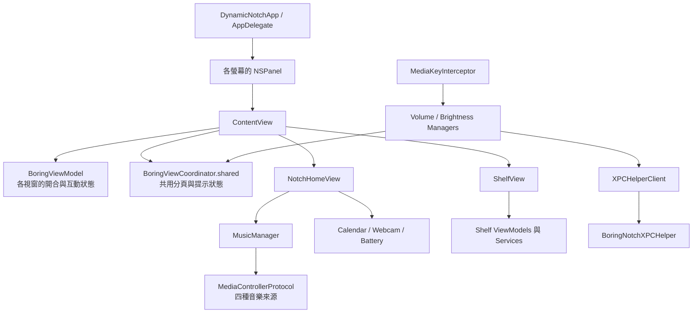

# Boring Notch 個人化修改完整對話紀錄

整理日期：2026-10-04。對話期間：2026-10-03 16:17～2026-10-04 00:17（Asia/Taipei，UTC+08:00）。

本文件依本次對話的原始文字紀錄，保存從 repo 閱讀、月曆與音樂修改、Swift 6 遷移、天氣、fork 同步，到 Codex 剩餘額度、每日 Token 統計與 Remaining 排版調整的討論。內容截至使用者提出本次更新要求為止，共 **35 則使用者訊息、121 則助理文字訊息**；包含回覆與工作中的進度說明，沒有將早期回覆重建為摘要。

匯出時僅作排版與連結調整：加入主題索引、發言者與時間，調整回覆內標題層級，將 repo 的本機絕對路徑改為相對路徑。未納入工具原始輸出、執行日誌或圖片；文字中提到的本機暫存路徑僅保留為當時操作的紀錄，未附上產物。保留當時的問法、判斷與說明，因此較早的功能狀態、檢查數量、尚未完成事項或 Git 狀態，應依後續對話理解，不代表文件建立後的即時狀態。

程式碼的目前定位與實作說明請看 [CODEBASE_MAP.md](CODEBASE_MAP.md)；同步原作者更新的操作與流程圖請看 [FORK_SYNC_GUIDE.md](FORK_SYNC_GUIDE.md)。

## 主題索引

1. [閱讀 repo 與說明程式碼架構](#turn-01)
2. [保存程式碼導覽與修改索引](#turn-02)
3. [首次初始化畫面與再次啟動行為](#turn-03)
4. [將 Calendar 改成整月月曆與事件圓點](#turn-04)
5. [在原本區域切換當日事件清單](#turn-05)
6. [查詢 Markdown 文件位置](#turn-06)
7. [移除音樂區左側 Apple Music 圖示](#turn-07)
8. [確認音樂與 Calendar 區塊的尺寸差異](#turn-08)
9. [評估統一尺寸的影響](#turn-09)
10. [改以相對尺寸調整首頁排版](#turn-10)
11. [分類約 50 個 build warning](#turn-11)
12. [評估 warning 修正與 Swift 6 升級](#turn-12)
13. [執行 warning 修正與 Swift 6 遷移](#turn-13)
14. [確認後續 Xcode build 設定](#turn-14)
15. [在歌名與作者右側加入專輯縮圖](#turn-15)
16. [新增目前地區天氣與預報頁面](#turn-16)
17. [討論 Open-Meteo 與原生 Calendar 資料來源差異](#turn-17)
18. [討論 WeatherKit 與 Apple Developer Program](#turn-18)
19. [加入天氣 API 呼叫限制、背景更新與快取](#turn-19)
20. [確認剩餘兩個 warning](#turn-20)
21. [確認 App Intents 提示對啟動的影響](#turn-21)
22. [評估約 100 MB 記憶體用量](#turn-22)
23. [討論使用 fork 保存個人化修改](#turn-23)
24. [確認 GitHub Desktop fork 是否成功](#turn-24)
25. [確認分支、commit 與 push 狀態](#turn-25)
26. [討論同步原作者更新的流程](#turn-26)
27. [將 fork 同步流程與圖表保存為 Markdown](#turn-27)
28. [評估新增 LLM provider 剩餘用量頁面](#turn-28)
29. [先實作 Codex 剩餘額度頁面](#turn-29)
30. [確認最近 7 天每日 Token 統計是否可行](#turn-30)
31. [確認每日統計的 API 呼叫頻率與限流策略](#turn-31)
32. [實作每日 Token 圖表、合計與跨重啟快取](#turn-32)
33. [匯出本次完整對話](#turn-33)
34. [調整 Remaining 的 Open Codex 與更新時間對齊](#turn-34)
35. [更新完整對話紀錄](#turn-35)

---

<a id="turn-01"></a>

## 01. 閱讀 repo 與說明程式碼架構

### 使用者 · 2026-10-03 16:17:41

> 先詳細看一下這份 repo 的 code，然後回報一下這個 repo 是在做什麼，以及相關程式碼架構

### 助理 · 2026-10-03 16:17:47

我會先看專案說明、目錄結構與主要入口，再追核心功能、狀態管理和系統整合，最後用繁體中文整理這個 repo 的用途與程式碼架構。

### 助理 · 2026-10-03 16:19:12

已確認這是 macOS 原生的「動態瀏海」工具：用置頂浮動視窗呈現音樂控制、檔案暫存、行事曆與系統提示。核心有一個重要分工：每個螢幕各自管理瀏海視窗與開合狀態，音樂、分頁和短暫提示則共用狀態；接下來我會追音樂控制、Shelf 檔案處理，以及主程式和 XPC helper 的責任邊界。

### 助理 · 2026-10-03 16:20:52

音樂部分有統一的 `MediaControllerProtocol`，讓 Now Playing、Apple Music、Spotify 與 YouTube Music 接到同一套 UI；Shelf 則分成 Model、ViewModel、Service，並用 security-scoped bookmark 保存檔案存取權。也確認部分功能依賴 macOS 私有介面，尤其是媒體資訊、鎖定畫面視窗和亮度控制。接下來會核對建置、測試，以及哪些項目仍只是預留實作。

### 助理 · 2026-10-03 16:26:16

這個 repo 是 **Boring Notch，一個把 macOS 螢幕頂端瀏海變成互動控制區的原生桌面工具**。它會在螢幕上方建立浮動視窗，依照滑鼠、手勢、拖放與系統事件，切換成音樂播放器、檔案暫存區、行事曆或音量／亮度提示。

我已追過主要入口、視窗生命週期、狀態管理、各功能的資料流、XPC helper，以及建置發布設定。以下以本機 commit `d58240c` 為準；這次是靜態程式碼閱讀，沒有修改檔案，也沒有實際編譯或啟動 App。

從使用者功能來看，目前程式碼包含：

| 功能 | 實際內容 |
|---|---|
| 動態瀏海 | 滑鼠停留、點擊、手勢展開／收合；支援多螢幕與沒有實體瀏海的螢幕 |
| 音樂控制 | 歌曲資訊、封面、播放控制、進度、音量、隨機／重複、部分來源的收藏功能與歌詞 |
| Shelf 檔案暫存 | 接收檔案、文字與連結，支援多選、拖出、Quick Look、AirDrop 與系統分享 |
| 檔案快捷操作 | 開啟、Finder 定位、重新命名、壓縮；圖片去背、轉檔與產生 PDF |
| 行事曆與提醒事項 | 顯示選定日期的事件與提醒，可切換提醒事項完成狀態 |
| 系統提示 | 電量、充電狀態，以及音量、螢幕亮度、鍵盤背光 HUD |
| 攝影機鏡子 | 在瀏海面板內顯示攝影機即時預覽 |
| 個人化 | 外觀、尺寸、快捷鍵、顯示位置、全螢幕隱藏、登入啟動與自動更新 |

架構上，我會把它歸類為 **SwiftUI + AppKit、以 MVVM 為主，搭配全域 Manager／Coordinator 的桌面應用程式**。目前約有 123 個 Swift 檔案、19,600 行 Swift 原始碼；Xcode 專案有兩個 target：主 App 與內嵌的 XPC service。功能主要集中在主 App 內，透過目錄與類別分工。

主要目錄可以這樣理解：

```text
boring.notch/
├── boringNotch/
│   ├── boringNotchApp.swift       App 入口、AppDelegate、視窗管理
│   ├── ContentView.swift         瀏海 UI 組裝與互動
│   ├── BoringViewCoordinator.swift
│   │                             全域分頁、短暫提示與顯示設定
│   ├── models/                   資料模型、ViewModel、設定鍵
│   ├── managers/                 音樂、行事曆、電量、音量、攝影機等
│   ├── MediaControllers/         各音樂來源的實作
│   ├── Providers/                EventKit 行事曆服務
│   ├── observers/                拖放、媒體按鍵、全螢幕監聽
│   ├── components/
│   │   ├── Notch/                視窗、外形、標頭與首頁
│   │   ├── Shelf/                Models / ViewModels / Views / Services
│   │   ├── Calendar/、Webcam/、Music/
│   │   ├── Live activities/      電量與 HUD 元件
│   │   └── Settings/、Onboarding/
│   ├── XPCHelperClient/          主 App 的跨程序呼叫
│   ├── private/                 私有 Spaces API 封裝
│   └── helpers/、extensions/、sizing/
├── BoringNotchXPCHelper/         輔助程序、亮度與輔助使用權限操作
├── mediaremote-adapter/          隨 App 打包的媒體資訊 adapter
├── boringNotch.xcodeproj/        Target、編譯設定、SPM 依賴
├── Configuration/dmg/           DMG 打包
├── updater/                     Sparkle 更新資訊
└── .github/                     CI、發布流程與腳本測試
```

執行時的主要關係如下；箭頭表示建立、使用或呼叫關係：



理解這份程式碼時，最重要的是下面幾組分工。

1. **AppDelegate 管視窗，ContentView 管瀏海內容。**

   入口在 [boringNotchApp.swift](boringNotch/boringNotchApp.swift#L15)。`DynamicNotchApp` 建立選單列項目與 Sparkle 更新器，`AppDelegate` 則負責建立瀏海視窗、處理螢幕變更、鎖定／解鎖、快捷鍵和初次使用流程。

   實際建立的視窗是 [BoringNotchSkyLightWindow](boringNotch/components/Notch/BoringNotchSkyLightWindow.swift#L34)，它繼承 `NSPanel`，設定透明背景、置頂層級、跨 Spaces 顯示，以及不取得一般視窗焦點。視窗內再用 `NSHostingView` 裝入 SwiftUI 的 `ContentView`。

   [ContentView.swift](boringNotch/ContentView.swift#L17) 負責決定現在呈現收合狀態、音樂活動、電池提示、HUD，還是展開後的 Home／Shelf，也處理 hover 延遲、手勢動畫和拖放開啟。

   瀏海尺寸集中在 [sizing/matters.swift](boringNotch/sizing/matters.swift#L15)：展開尺寸目前是固定基準，收合尺寸會參考螢幕 safe area、實體瀏海區域、選單列高度與使用者設定。

2. **畫面狀態分成「每個視窗」與「全 App 共用」兩層。**

   | 狀態物件 | 管理內容 | 範圍 |
   |---|---|---|
   | `BoringViewModel` | 開合、尺寸、螢幕 UUID、拖放目標、攝影機展開等 | 每個瀏海視窗 |
   | `BoringViewCoordinator.shared` | Home／Shelf 分頁、Sneak Peek、短暫展開提示、偏好螢幕等 | 全 App 共用 |
   | 各功能的 `.shared` Manager | 音樂、電池、攝影機、Shelf 項目等 | 全 App 共用 |
   | SwiftUI `@State` | hover task、拖曳進度、局部 UI 狀態 | 個別 View |

   這表示 **多螢幕的瀏海可以各自開合，但共用音樂資料與目前分頁**。追多螢幕行為時，這個區別很重要。

   狀態傳遞主要使用 `ObservableObject`、`@Published` 與 Combine；部分跨元件事件使用 `NotificationCenter`，設定則混用 `Defaults` 與 `@AppStorage`。相關核心在 [BoringViewModel.swift](boringNotch/models/BoringViewModel.swift#L12) 和 [BoringViewCoordinator.swift](boringNotch/BoringViewCoordinator.swift#L49)。

3. **音樂模組有清楚的來源抽象，但 MusicManager 承擔的責任較多。**

   UI 主要觀察 [MusicManager.swift](boringNotch/managers/MusicManager.swift#L17)，它依設定選擇一個 active controller。所有來源都遵循 [MediaControllerProtocol](boringNotch/MediaControllers/MediaControllerProtocol.swift#L12)，提供統一的播放命令和 `PlaybackState` publisher。

   | Controller | 整合方式 |
   |---|---|
   | `NowPlayingController` | 透過打包的 MediaRemoteAdapter 取得系統媒體資訊；用私有 MediaRemote API 傳送播放命令 |
   | `AppleMusicController` | AppleScript 控制 Music，監聽播放狀態通知 |
   | `SpotifyController` | AppleScript 控制 Spotify，監聽播放通知並下載封面 |
   | `YouTubeMusicController` | 連接第三方桌面播放器的本機 HTTP／WebSocket API，預設 `localhost:26538`，有驗證、重連與輪詢備援 |

   更新流程是：

   ```text
   播放器／系統
     → Controller
     → PlaybackState publisher
     → MusicManager
     → 封面、曲名、按鈕、進度條與短暫提示
   ```

   `MusicManager` 還處理封面平均色、播放進度推算、閒置判斷、動畫與歌詞。歌詞會優先嘗試 Apple Music，另有 LRCLIB 查詢與 LRC 時間軸解析。

   另外，程式會用 `MediaChecker` 檢查 Now Playing adapter 是否可用，必要時退回 Apple Music。這是相容性策略的一部分。

4. **Shelf 是分層最明確的功能，但單項操作仍集中在大型 ViewModel。**

   [ShelfStateViewModel.swift](boringNotch/components/Shelf/ViewModels/ShelfStateViewModel.swift#L10) 管項目集合、去重、載入與移除；`ShelfSelectionModel` 管選取；`ShelfItemViewModel` 管個別項目的互動和選單。

   拖入內容的流程是：

   ```text
   NSItemProvider
     → ShelfDropService 辨識檔案／連結／文字／資料
     → ShelfItem
     → ShelfStateViewModel 去重與更新集合
     → ShelfPersistenceService 儲存
     → ShelfView 顯示
   ```

   [ShelfItem](boringNotch/components/Shelf/Models/ShelfItem.swift#L11) 有三種主要型態：檔案 bookmark、文字與 URL。一般檔案透過 **security-scoped bookmark** 保存參照及存取能力；原始資料則可能先轉成暫存檔。

   [ShelfPersistenceService](boringNotch/components/Shelf/Services/ShelfPersistenceService.swift#L14) 將集合寫入 Application Support 下的 `boringNotch/Shelf/items.json`。縮圖由 actor `ThumbnailService` 管快取與重複請求，預覽使用 Quick Look，分享使用 `NSSharingService`／`NSSharingServicePicker`。

   還有一個容易忽略的協調機制：[SharingStateManager](boringNotch/models/SharingStateManager.swift#L17) 會在分享互動期間阻止瀏海自動關閉，避免滑鼠移開後分享介面失去依附的 UI。

5. **系統 HUD 橫跨主程序與 XPC helper。**

   [MediaKeyInterceptor.swift](boringNotch/observers/MediaKeyInterceptor.swift#L47) 在主 App 裡建立 `CGEvent` event tap，攔截音量、靜音、螢幕亮度與鍵盤背光按鍵。

   後續依功能分流：

   - 音量：`VolumeManager` 直接使用 CoreAudio。
   - 螢幕亮度：`BrightnessManager` 經 XPC 呼叫 helper。
   - 鍵盤背光：`KeyboardBacklightManager` 經 XPC 呼叫 helper。
   - 顯示提示：更新 Coordinator，交由 SwiftUI HUD 呈現。

   [XPCHelperClient](boringNotch/XPCHelperClient/XPCHelperClient.swift#L5) 用 `NSXPCConnection` 與 AsyncXPCConnection 封裝非同步呼叫。另一端的 [BoringNotchXPCHelper.swift](BoringNotchXPCHelper/BoringNotchXPCHelper.swift#L13) 負責輔助使用權限檢查，以及透過 CoreBrightness、DisplayServices、IOKit 操作亮度。

   專案的 entitlements 將主 App 設為 sandboxed，helper 設為 non-sandboxed。這個程序邊界是理解系統整合的重要部分。

6. **行事曆、電池與攝影機各有自己的系統介面封裝。**

   | 模組 | 資料流與責任 |
   |---|---|
   | [CalendarManager](boringNotch/managers/CalendarManager.swift#L15) | 經 `CalendarService` 呼叫 EventKit，將事件與提醒轉成共用 `EventModel`，管理授權、清單選擇與完成狀態 |
   | [BatteryActivityManager](boringNotch/managers/BatteryActivityManager.swift#L6) | 監聽 IOKit 電源變更，再交給 `BatteryStatusViewModel` 更新畫面與觸發提示 |
   | [WebcamManager](boringNotch/managers/WebcamManager.swift#L10) | 管理 AVFoundation 授權、裝置變更、capture session 與 preview layer |
   | [FullscreenMediaDetector](boringNotch/observers/FullscreenMediaDetection.swift#L15) | 透過 MacroVisionKit 取得各螢幕全螢幕狀態，供 ViewModel 決定是否隱藏瀏海 |

設定與交付方面，大部分設定鍵集中在 [Constants.swift](boringNotch/models/Constants.swift#L71)，設定介面在 `SettingsView.swift`，初次授權與音樂來源選擇在 `Onboarding/`。主要第三方依賴包括 Defaults、KeyboardShortcuts、LaunchAtLogin、Sparkle、Lottie、SkyLightWindow、MacroVisionKit 與 AsyncXPCConnection。

建置由 Xcode project 與 Swift Package Manager 管理，deployment target 是 macOS 14。發布流程涵蓋 archive、簽章、DMG、stable／beta／nightly、Sparkle appcast 與 Homebrew cask；可從 [build_reusable.yml](.github/workflows/build_reusable.yml#L1) 看完整打包步驟。

從維護角度，我會特別記住這幾點：

- **全域狀態耦合偏高。** 多數 View 直接取用 `.shared`，Manager 也會直接觸發 UI 動畫或 Coordinator；修改共用狀態時，要一起考慮其他視窗與功能。
- **部分檔案責任集中。** `SettingsView.swift` 約 1,800 行、`ShelfItemViewModel.swift` 約 1,100 行、`MusicManager.swift` 約 740 行。尤其 Shelf 的 ViewModel 也包含 AppKit 選單、對話框與檔案操作協調。
- **私有 API 相容性是實際架構成本。** MediaRemote、SkyLight／CGS、CoreBrightness、DisplayServices 都出現在核心路徑中，系統版本更新時需要特別驗證。
- **有預留或實驗性程式碼。** Downloads 的設定入口被註解，`DownloadWatcher` 只有資料容器；Extensions 設定也大多被註解。現有音樂頻譜則是依播放狀態驅動的隨機長條動畫。
- **主 App 自動化測試覆蓋尚不明顯。** 專案沒有看到 XCTest／UI test target；現有 Python 測試主要針對版本與發布流程，`TestView.swift` 是 UI 實驗元件。另有工具鏈設定差異：README 要求 Xcode 26+，一般 CI 仍指定 Xcode 16，reusable build 預設是 26.6。

如果接下來要開始改功能，建議先讀 `boringNotchApp.swift → ContentView.swift → BoringViewModel.swift／BoringViewCoordinator.swift`，掌握視窗與狀態邊界，再沿著對應的 Manager 或 Shelf Services 往下追。

<a id="turn-02"></a>

## 02. 保存程式碼導覽與修改索引

### 使用者 · 2026-10-03 16:30:01

> 因為我可能會調整 code 裡面的一些功能。所以你先把你現在讀到的內容儲存成一個 markdown 檔，然後我需要你來修改的時候，你可以直接看這份 markdown 檔案來加快 locate 到相關 code。

### 助理 · 2026-10-03 16:30:06

我會把這次讀到的架構、資料流與關鍵檔案整理成 Markdown，並加入「要改哪個功能，先看哪些程式碼」的索引，方便後續修改時快速定位。

### 助理 · 2026-10-03 16:31:40

我會把檔案放在 repo 根目錄的 `CODEBASE_MAP.md`。內容會以功能索引和類別／函式名稱為主，並標註目前的 commit、共用狀態邊界與尚未接通的功能，方便之後對照實際程式碼更新。

### 助理 · 2026-10-03 16:39:00

已儲存到 repo 根目錄的 [CODEBASE_MAP.md](CODEBASE_MAP.md)。

包含功能對應的檔案／函式索引、架構、資料流、狀態分工、XPC、設定與建置資訊，並標註閱讀基準 commit。所有檔案連結已檢查有效。

後續修改時，我會先讀這份索引定位，再核對當下程式碼。

<a id="turn-03"></a>

## 03. 首次初始化畫面與再次啟動行為

### 使用者 · 2026-10-03 16:46:17

> 我在 xcode build 完 project 後，它第一次有顯示初始化畫面。第二次就沒有顯示畫面，是正常的嗎？

### 助理 · 2026-10-03 16:46:23

我先對照剛整理的索引和啟動判斷，確認初始化畫面何時會顯示，以及第二次啟動後預期會看到什麼。

### 助理 · 2026-10-03 16:47:08

**正常，如果你指的是第一次的歡迎／權限設定畫面，而且已完成初始化流程。**

程式碼的判斷是：

1. `firstLaunch` 預設為 `true`，透過 `@AppStorage` 持久保存。[程式碼](boringNotch/BoringViewCoordinator.swift#L59)
2. 音樂來源選擇完成後，將它設為 `false`。[程式碼](boringNotch/components/Onboarding/OnboardingView.swift#L127)
3. 下次啟動就會略過初始化畫面。重新 Build／Run 通常不會清除這個設定。[啟動判斷](boringNotch/boringNotchApp.swift#L425)

第二次啟動後，預期可以：

- 把滑鼠移到螢幕頂端瀏海位置，讓面板展開。
- 點選選單列的星光圖示，再選 **Settings** 開啟設定。

**如果連選單列圖示都沒有，而且瀏海也完全沒反應，就需要另外排查啟動或顯示問題。**

<a id="turn-04"></a>

## 04. 將 Calendar 改成整月月曆與事件圓點

### 使用者 · 2026-10-03 17:50:24

> 我目前想調整的是，目前 notch 的 Calendar 畫面是一條橫線，我希望調整成是一個月的 Calendar，然後如果那一天有事情的話，會在那一天顯示一個點，我點那一天之後才會顯示是有什麼事。你看一下要怎麼進行調整

### 助理 · 2026-10-03 17:51:30

我會先看目前行事曆的日期選擇、事件查詢與版面限制，確認怎麼改成月份格狀日曆、用圓點標示有行程的日期，並在點選後顯示當天內容。

<a id="turn-05"></a>

## 05. 在原本區域切換當日事件清單

### 使用者 · 2026-10-03 17:54:03

> - 在原本區域切換成當日清單

### 助理 · 2026-10-03 17:54:08

了解，點選日期後會在原本區域顯示當日行程，並提供返回月曆的按鈕。我會保留目前瀏海的大小，把橫向日期列改成月曆格子，並讓圓點與當日清單套用相同的行程篩選設定。

### 助理 · 2026-10-03 17:55:29

目前程式只查詢選定那一天的行程；我會改成一次取得整個月份，再把行程分配到各日期，讓圓點和點選後的清單保持一致。也會處理跨日行程、跨月切換，以及外部行事曆更新後的刷新。

### 助理 · 2026-10-03 17:57:35

月曆與當日清單的切換已寫好，也加入了上／下個月及回到本月的操作。接下來會檢查六週月份是否能放進原本的區域，並驗證月底、閏年、跨日行程和提醒事項的日期歸屬。

### 助理 · 2026-10-03 18:00:17

已改用各視窗自己的月份狀態，避免多螢幕瀏海互相影響。圓點會沿用已選行事曆及隱藏行程的設定；Xcode 正在編譯，同時也在檢查日期邊界與精簡版面的呈現。

### 助理 · 2026-10-03 18:01:34

完整 Xcode build 已通過，28 項日期邏輯檢查也都通過。我也檢視了 215 與 170 點寬的月曆渲染，四週到六週的月份都能完整放進原本高度；接著會把這次的新架構與定位方式補進 `CODEBASE_MAP.md`。

### 助理 · 2026-10-03 18:02:42

已完成修改，現在會：

- 顯示整個月的月曆，支援切換月份及回到本月。
- 有行程的日期顯示圓點。
- 點選日期後，在原區域顯示當日清單，並可返回月曆。
- 維持瀏海大小，沿用既有的行程篩選設定。

Xcode build、28 項日期邏輯檢查與版面渲染檢查皆通過；尚未以真實行程操作完整 App。你可以重新在 Xcode Build & Run 試用。

修改架構與程式碼定位已更新至 [CODEBASE_MAP.md](CODEBASE_MAP.md)。

<a id="turn-06"></a>

## 06. 查詢 Markdown 文件位置

### 使用者 · 2026-10-03 18:03:06

> 你寫的 markdown 檔在什麼位置啊

### 助理 · 2026-10-03 18:03:09

放在 repo 根目錄：

[CODEBASE_MAP.md](CODEBASE_MAP.md)

完整路徑：`CODEBASE_MAP.md`

<a id="turn-07"></a>

## 07. 移除音樂區左側 Apple Music 圖示

### 使用者 · 2026-10-03 18:06:46

> 幫我調整一下，目前畫面左邊的 apple music 會先顯示一個 icon，然後才是播放歌曲，以及播放，暫停等等的按鈕。幫忙將 apple music 的 icon拿掉

### 助理 · 2026-10-03 18:06:49

我會先確認音樂區左側圖示的來源，再移除圖示並調整間距，保留歌曲資訊與播放控制。

### 助理 · 2026-10-03 18:07:26

左側那塊是封面元件，沒有封面時會顯示 Apple Music 圖示。我會移除展開畫面的這一整塊，讓歌曲資訊、進度條與播放按鈕直接使用左側空間。

### 助理 · 2026-10-03 18:08:45

已移除展開畫面左側的 Apple Music 圖示／封面區塊，歌曲資訊、進度條與播放按鈕現在會直接使用左側空間。

Xcode build 已通過，也已更新 `CODEBASE_MAP.md`。重新 Build & Run 就能看到。

<a id="turn-08"></a>

## 08. 確認音樂與 Calendar 區塊的尺寸差異

### 使用者 · 2026-10-03 19:29:47

> 我覺得畫面的 Calendar 和 Apple Music 的大小不太一致，apple music 的畫面比較長一點。先幫忙確認一下這是否是真的

### 助理 · 2026-10-03 19:29:50

我會先檢查兩個區塊的尺寸與版面設定，確認音樂區是否確實比 Calendar 更長，以及差異是在寬度還是高度。

### 助理 · 2026-10-03 19:30:33

是，**從目前的排版設定確認，兩個區塊確實沒有統一尺寸**。

| 區塊 | 寬度 | 高度 |
|---|---|---|
| Calendar | 固定 215 pt | 固定 120 pt |
| 音樂區 | 填滿剩餘空間，一般約 348 pt | 隨容器延伸，沒有固定為 120 pt |

移除左側圖示後，空出的寬度全部給了歌曲資訊與進度條，所以音樂區會顯得更長；高度也可能比月曆高，造成底部不齊。

主要設定在 [NotchHomeView.swift](boringNotch/components/Notch/NotchHomeView.swift#L352)。這次只有確認，尚未修改程式。

<a id="turn-09"></a>

## 09. 評估統一尺寸的影響

### 使用者 · 2026-10-03 19:33:25

> 如果兩個區塊統一尺寸的話，會導致其他 bug 嗎？想幫忙確認看看

### 助理 · 2026-10-03 19:33:28

我會沿著首頁版面、播放控制、歌詞與鏡子模式檢查，確認統一尺寸可能影響哪些功能，再判斷適合怎麼調整。

### 助理 · 2026-10-03 19:34:25

目前找到兩個需要處理的地方：音樂區若壓到月曆的 120 高度，文字、進度條和控制按鈕可能互相擠壓；若寬度也固定成 215，使用五個控制按鈕並展開音量滑桿時可能放不下。我會再核對尺寸計算，以及切換鏡子模式時的影響。

### 助理 · 2026-10-03 19:35:22

可以統一尺寸，但**直接把兩邊都設成 `215 × 120`，確實有排版風險**。我檢查後發現：

| 情境 | 可能的問題 |
|---|---|
| 音樂區高度縮到 120 | 目前內容估算至少需要約 124 pt，還沒算外層間距；開啟歌詞後約 138 pt，可能讓進度條與按鈕重疊。 |
| 音樂區寬度縮到 215 | 五個控制按鈕搭配展開的音量滑桿，約需要 230 pt，可能超出區塊。 |
| 同時開啟鏡子 | 會多出第三個區塊，需要重新分配寬度，不能固定套用雙欄尺寸。 |
| 寬度動態變化 | 現有歌曲跑馬燈沒有直接監聽寬度變化，可能出現長歌名被截斷卻沒有開始捲動。 |

建議讓兩個區塊**平均分配可用寬度、使用相同高度**，並同步調整音樂間距與月曆列高；鏡子模式另外處理。

目前沒有發現播放控制或行事曆查詢邏輯依賴固定尺寸，風險主要集中在畫面配置。這次是程式碼與尺寸計算檢查，尚未修改程式或驗證新版實際畫面。

<a id="turn-10"></a>

## 10. 改以相對尺寸調整首頁排版

### 使用者 · 2026-10-03 19:37:28

> 感覺不一定需要直接設定尺寸，有沒有類似相對尺寸的方式來解決？因為目前看著蠻突兀的

### 助理 · 2026-10-03 19:37:34

可以，這裡更適合用相對尺寸：先扣掉左右留白、區塊間距與鏡子的空間，再讓音樂和 Calendar 平分剩餘寬度，高度也由同一個內容區域決定。我會依這個方向調整，並一起處理音樂按鈕、歌詞與月曆列高的適應方式。

### 助理 · 2026-10-03 19:40:08

我會讓兩欄隨可用空間一起伸縮，月曆日期列也跟著分配高度。音樂區則改用自然排列與彈性留白；控制列空間不足時可橫向捲動，避免音量滑桿擠進月曆。長歌名的跑馬燈也會在欄寬改變後重新計算。

### 助理 · 2026-10-03 19:42:20

相對尺寸的修改已通過編譯。現在我會用實際的 SwiftUI 元件檢查雙欄、開啟鏡子、歌詞與音量滑桿等組合，確認寬高對齊後，內容也能正常放進去。

### 助理 · 2026-10-03 19:49:12

預覽中，音樂與月曆已能等寬、上下對齊；加入歌詞與展開音量滑桿後也沒有重疊。鏡子會先保留正方形空間，其餘空間再由兩欄平分。我正在做最後的縮窄與寬度切換檢查。

### 助理 · 2026-10-03 19:51:56

縮放測試抓到一個細節：長歌名在縮窄後會正常捲動，但放寬後舊動畫可能繼續跑。我正在修正這個重設問題，讓切換鏡子或欄寬時，文字能回到正確位置。

### 助理 · 2026-10-03 19:53:18

最後的縮放檢查已通過：欄寬變窄時，長歌名會開始捲動；放寬後會停止並回到開頭。雙欄、鏡子、歌詞及音量滑桿的預覽也都已確認，接著完成最後一次建置並更新程式碼導覽。

### 助理 · 2026-10-03 19:54:28

可以，已改成**依可用空間自動分配的相對尺寸**：

- 音樂與 Calendar 平分剩餘寬度，共用高度，上下對齊。
- 開啟鏡子時，自動預留空間，再重新分配兩欄。
- 月曆列高與音樂間距隨容器調整；長歌名也會隨欄寬重新判斷是否捲動。

Xcode build、六種測試版面預覽與跑馬燈縮放檢查皆通過，`CODEBASE_MAP.md` 也已更新。重新 Build & Run 就能查看效果。

<a id="turn-11"></a>

## 11. 分類約 50 個 build warning

### 使用者 · 2026-10-03 19:55:24

> 目前這個 project 經過我們的討論和修正後，出現了大概 50 個 warning，先幫忙確認一下這些 warning 的種類是什麼。

### 助理 · 2026-10-03 19:55:27

我會先查看最近一次 Xcode build 的完整警告紀錄，依種類、來源檔案與是否涉及這次修改分類；這一步先確認原因，不改程式。

### 助理 · 2026-10-03 19:56:35

目前看到的警告主要集中在 Swift 並行處理、未使用的變數，以及多餘的 `try`／`await`。最近一次增量 build 只顯示少數警告，所以我也讀取了 Xcode 保存的建置紀錄，並和修改前的紀錄比對，避免把原有警告算成這次新增的問題。

### 助理 · 2026-10-03 20:00:01

完整建置已成功：Xcode 結果列出 46 個 warning，另外 log 有 2 個 AppIntents 提示。45 個 Swift 程式碼警告都能在修改前的建置紀錄找到，這次月曆與音樂排版修改沒有新增這類警告。我會把分類與檔案位置補進原本的 Markdown，方便之後逐項處理。

### 助理 · 2026-10-03 20:01:19

確認了。我重新做完整 Debug build，**建置成功、0 errors**。Xcode 統計 **46 個 warning**，加上 log 裡另外 2 個 AppIntents 提示，共 48 項：

| 類型 | 數量 | 意思 |
|---|---:|---|
| `Sendable` 並行安全 | 29 | XPC、Spotify、YouTube Music 等物件跨非同步工作使用，編譯器無法確認安全性 |
| `MainActor` 隔離 | 5 | 部分 UI／螢幕資訊操作，未明確保證在主 actor 執行 |
| `weak`／強引用不一致 | 1 | Shelf 分享功能的 closure 引用方式需要檢查 |
| 未使用的變數／回傳值 | 4 | 宣告或呼叫後沒有使用結果 |
| 多餘的 `try`／`await`、無法進入的 `catch` | 6 | 語法與實際非同步／拋錯行為不一致 |
| 最低 macOS 版本不一致 | 1 | App 設為 macOS 14，但 MediaRemoteAdapter framework 要求 15 |
| AppIntents metadata 提示 | 2 | 沒有相關 framework，建置工具略過資料擷取 |

**45 個 Swift 程式碼警告全部都存在於修改前的建置紀錄**；另外的 framework、AppIntents 提示也已存在。這次月曆與音樂排版修改沒有新增 warning。

比較需要優先處理的是並行安全、MainActor 隔離與系統版本相容性。其中 **26 個警告明確指出，改用 Swift 6 language mode 後會變成 error**；目前專案仍是 Swift 5 mode。

詳細分類與檔案位置已補進 [CODEBASE_MAP.md 第 13 節](CODEBASE_MAP.md)。這次只完成盤點，尚未修改警告相關程式碼。

<a id="turn-12"></a>

## 12. 評估 warning 修正與 Swift 6 升級

### 使用者 · 2026-10-03 20:03:57

> 判斷一下哪些 warning 需要調整，以及是否需要升級到 swift 6

### 助理 · 2026-10-03 20:04:01

我會先檢查警告對應的執行流程與專案設定，區分需要修正的風險、可順手清理的項目，再評估切換 Swift 6 的必要性與影響範圍。

### 助理 · 2026-10-03 20:05:05

目前看來，優先值得修正的是 XPC 與音樂 controller 的狀態存取方式；部分 MainActor 警告則是既有 UI 回呼缺少隔離標註。另外，本機已使用 Swift 6.4 編譯器，專案採用的是 Swift 5 語言模式。切換到 Swift 6 模式會啟用更嚴格的檢查，不會自動修好這些警告。

### 助理 · 2026-10-03 20:06:15

另外確認了 ZIP 壓縮的兩個警告：底層以 `nil` 表示失敗，所以外層 `catch` 永遠不會執行，修正時應一併補上失敗處理。Swift 6 則適合分階段遷移；目前只開啟 `targeted` 檢查，現有 26 個會變成 error 的警告，還不能代表完整遷移範圍。

### 助理 · 2026-10-03 20:07:50

我的建議是：**先修正有實際風險的 warning，暫時保留 Swift 5 語言模式；Swift 6 留作後續獨立遷移。**

檢查程式碼後，我會這樣排序：

| 項目 | 判斷 | 建議處理方式 |
|---|---|---|
| `Sendable`／`MainActor` | **優先修正** | XPC、音樂 controller 的狀態由多個非同步工作存取，應統一隔離方式。部分 UI 回呼則需要補上正確標註；目前尚未重現競態問題 |
| macOS 最低版本不一致 | **若要支援 macOS 14，需優先處理** | framework 要求 15，必須調整依賴或載入條件；提高最低版本會影響使用者支援範圍 |
| ZIP 的 `try`／`catch` | **建議修正** | 壓縮失敗實際回傳 `nil`，外層 `catch` 不會執行。應補上失敗處理 |
| 分享功能的 `weak`／強引用 | **建議修正** | 明確整理 Task 與 delegate 的生命週期，目前不能直接認定有記憶體洩漏 |
| 未使用變數、其餘多餘的 `try`／`await` | **可順手清理** | 多半是維護品質問題，修改風險較低；授權呼叫本身仍須保留 |
| `@preconcurrency import` 建議 | **視情況處理** | 先修隔離問題，再判斷是否需要套件相容性標註 |
| AppIntents 提示 | **可以保留** | 目前沒有相關功能，不需要為了消除提示加入 framework |

**目前不需要立即切換 Swift 6。** 本機已經使用 **Swift 6.4 編譯器**，專案設定的則是 **Swift 5 語言模式**。切換語言模式會啟用完整並行檢查，並將相應警告提升為 error。[Apple 建置設定說明](https://developer.apple.com/documentation/xcode/build-settings-reference?changes=l_3)

現有 26 個警告已明確指出會變成 error，而且目前只開啟 `targeted` 檢查，完整檢查可能再找出其他問題。因此建議依序：

1. 保留 Swift 5 模式，先修 XPC、音樂狀態與 UI 隔離。
2. 在獨立遷移分支開啟 `SWIFT_STRICT_CONCURRENCY = complete`，處理完整警告。
3. 驗證權限、亮度、音樂切換、Shelf 與多螢幕功能後，再切換 Swift 6。

這也符合 [Swift 官方的漸進遷移策略](https://www.swift.org/migration/documentation/swift-6-concurrency-migration-guide/migrationstrategy/)。

評估已補進 [CODEBASE_MAP.md](CODEBASE_MAP.md)。本次未修改功能程式碼或語言模式，也尚未執行 Swift 6 模式建置。

<a id="turn-13"></a>

## 13. 執行 warning 修正與 Swift 6 遷移

### 使用者 · 2026-10-03 20:11:25

> 你根據你提出的三點建議進行調整

### 助理 · 2026-10-03 20:11:28

我會依序修正並行與 UI 隔離問題、開啟完整並行檢查，再切換 Swift 6 並建置驗證。先確認目前分支與既有修改，保留我們之前完成的月曆和音樂排版調整。

### 助理 · 2026-10-03 20:13:09

已建立 `codex/swift6-concurrency` 分支。第一輪把 XPC、音樂播放狀態與亮度 UI 的存取集中到明確的 actor，並整理分享、壓縮與多餘語法的警告；接下來會用編譯結果確認哪些呼叫端也需要一起調整。

### 助理 · 2026-10-03 20:20:11

Swift 5 模式下的完整並行檢查已建置成功，也找出原先未顯示的警告，目前共 126 項，主要新增在攝影機的背景佇列、Shelf 服務與系統回呼。我會逐一整理這些邊界，確認背景工作和 UI 更新各自的執行位置，再切換語言模式。

### 助理 · 2026-10-03 20:24:02

攝影機目前把 UI 狀態與 capture session 混在不同佇列操作，我正在把它們分開，並確保快速開關時，較晚完成的啟動工作不會重新打開預覽。其他修正也會保留 macOS 14 支援，讓不支援的 MediaRemote adapter 改走既有音樂來源 fallback。

### 助理 · 2026-10-03 20:26:51

目前 Swift 5 模式搭配 `complete` 檢查已建置成功，這輪沒有再出現程式碼警告。接著會加入針對攝影機快速開關、拖放資料回呼、檔案存取與壓縮的回歸檢查，再驗證 Swift 6 的 Debug 與 Release 建置。

### 助理 · 2026-10-03 20:30:48

17 項並行回歸檢查已通過，包括啟動中關閉攝影機、快速反覆開關、失敗後重試，以及背景拖放回呼與 ZIP 成敗處理。切換 Swift 6 後另發現幾個原本由 property wrapper 隱含推導的 UI 隔離設定，我正在補成明確標註。

### 助理 · 2026-10-03 20:41:08

Swift 6 的 Debug、Release 建置都已成功，45 項回歸檢查也通過了。我正在補驗 XPC 的實際訊息往返與 UI 顯示，並檢查系統通知回呼，避免出現編譯通過、收到背景通知時卻違反 actor 隔離的情況。

### 助理 · 2026-10-03 20:43:41

目前 Swift 6 的程式碼警告已清除，建置只剩 AppIntents metadata 略過的工具提示。我正在補做 XPC 連線中斷與重連測試，完成後會把修改位置、驗證結果和後續測試方式更新到 `CODEBASE_MAP.md`。

### 助理 · 2026-10-03 20:45:00

XPC 的實際訊息往返、連線重用與中斷後重連都已通過；目前共有 60 項回歸檢查通過，包含相機快速開關、拖放資料、ZIP 失敗處理和月曆日期邊界。最低支援版本仍保留 macOS 14；該版本會避開需要 macOS 15 的 MediaRemoteAdapter，改用既有 Apple Music 控制方式。

### 助理 · 2026-10-03 20:46:02

已用 Swift 6 建出的實際 UI 元件檢查 7 種畫面配置，音樂、月曆、歌詞與鏡子版面都能正常渲染，沒有看到裁切或跑版。Debug、Release 建置與 29 項既有 workflow 檢查也已通過；接下來收尾更新文件，註明實機權限與硬體操作尚未驗證的範圍。

### 助理 · 2026-10-03 20:48:19

已完成調整，修改位於 `codex/swift6-concurrency` 分支，尚未 commit。

1. **修正 warning**：整理 XPC、音樂、相機及分享流程的並行隔離，補上 ZIP 壓縮失敗處理，清除多餘語法。
2. **保留 macOS 14 支援設定**：調整 MediaRemoteAdapter 載入條件與備援方式，消除版本不一致的 linker 警告。
3. **完成 Swift 6 遷移**：主 App／XPC helper 均啟用完整並行檢查，CI 工具鏈同步更新。

驗證結果：

- Debug、Release 建置成功，**Swift 與 linker warning 均為 0**。
- 60 項回歸檢查、29 項 workflow 測試通過。
- 7 種 UI 配置渲染檢查正常。

目前保留 AppIntents metadata 略過的工具提示。真實權限、硬體操作與 macOS 14 執行仍需實機驗證。

修改位置與測試方式已更新至 [CODEBASE_MAP.md 第 14 節](CODEBASE_MAP.md)。

<a id="turn-14"></a>

## 14. 確認後續 Xcode build 設定

### 使用者 · 2026-10-03 21:01:30

> 如果是這樣子的話，我要 build 這個 project 是否需要調整設定？

### 助理 · 2026-10-03 21:01:33

我先確認目前專案與簽署設定，再整理你在 Xcode 建置時需要注意的地方。

### 助理 · 2026-10-03 21:01:53

**以你目前這台電腦來說，不需要額外調整專案設定，可以直接在 Xcode build。** 已確認你安裝的是 Xcode 27.0，符合這次修改的工具鏈需求。

以下設定已經寫進專案：

- Swift Language Version：**Swift 6**
- Strict Concurrency Checking：**Complete**
- macOS Deployment Target：維持 **14.0**

操作方式維持原本流程：

1. 開啟 `boringNotch.xcodeproj`。
2. Scheme 選擇 `boringNotch`，執行目的地選 `My Mac`。
3. 按 **⌘B** 建置，或 **⌘R** 執行。

如果 Xcode 仍顯示先前的 warning，可以先用 **Product → Clean Build Folder（⇧⌘K）**，再重新建置。

簽署設定維持原本即可。我驗證時使用的 `CODE_SIGNING_ALLOWED=NO` 只是命令列建置參數，不需要加進你的 Xcode 設定。

另外，你的命令列工具目前指向 CommandLineTools；**這不影響從 Xcode 介面建置**，只有使用 Terminal 的 `xcodebuild` 時才需要指定完整 Xcode 路徑。

<a id="turn-15"></a>

## 15. 在歌名與作者右側加入專輯縮圖

### 使用者 · 2026-10-03 21:21:34

> 音樂的部分，有辦法將專輯的縮圖放進來嗎? 放在音樂名稱和作者的右邊就可以了

### 助理 · 2026-10-03 21:21:37

我會把專輯縮圖加在歌名與作者的右側，並確認它能配合目前音樂／月曆的相對尺寸配置。

### 助理 · 2026-10-03 21:22:21

現有程式已經有專輯封面資料。我會讓縮圖與歌名、作者兩行文字等高，歌詞繼續放在下方；有實際封面時才顯示，沒有封面時讓文字使用完整寬度。

### 助理 · 2026-10-03 21:23:46

縮圖已加入，Debug 建置通過，沒有新增編譯警告。我正在檢查一般雙欄、開啟鏡子及較窄畫面，確認縮圖不會擠到播放控制列，長歌名也仍能正常顯示。

### 助理 · 2026-10-03 21:24:35

已加上，專輯縮圖現在會顯示在**歌名與作者的右側**：

- 縮圖高度配合兩行文字，保持現有音樂／月曆比例。
- 沒有封面時，文字使用完整寬度。
- 歌詞仍在下方，播放按鈕位置維持原樣。

Debug 建置與 9 種版面檢查通過，沒有新增編譯警告。修改紀錄已更新至 [CODEBASE_MAP.md](CODEBASE_MAP.md)。

<a id="turn-16"></a>

## 16. 新增目前地區天氣與預報頁面

### 使用者 · 2026-10-03 21:37:34

> 看起來不錯。再幫忙加一個頁面，目前只有主頁和 airdrop 功能頁面。我想加一個 天氣 的頁面，顯示目前地區的天氣，以及天氣預測。你看一下要怎麼調整

### 助理 · 2026-10-03 21:37:40

我先確認目前分頁切換、定位權限與設定的結構，再找出適合接入天氣資料的方式，讓新頁面能顯示目前地區的天氣與預報。

### 助理 · 2026-10-03 21:39:13

目前分頁結構可以直接增加第三個「天氣」頁。我會做成左側顯示所在地區、溫度與天氣狀況，右側可切換未來 24 小時和 7 天預報，並沿用現有瀏海尺寸。

資料先採用免金鑰的 Open-Meteo，適合目前自行 build 使用；它的免費 API 限非商業用途。定位會在使用天氣功能時才請求授權，也會補上定位失敗、離線和重新整理的狀態。[資料來源說明](https://open-meteo.com/en/terms)

### 助理 · 2026-10-03 21:43:25

天氣資料、定位與畫面已拆成獨立元件，方便之後更換資料來源或調整預報內容。另有一個需要一起處理的地方：目前分頁入口會隨 Shelf 設定隱藏，我會保留天氣入口，避免關閉 AirDrop／Shelf 後就無法開啟天氣頁。

### 助理 · 2026-10-03 21:46:17

天氣頁已能編譯，也已用台北的公開座標確認 API 能回傳目前天氣、逐時預報和 7 天預報。現在補驗快取、定位拒絕及斷線情境：頁面會保留上次成功取得的資料，並標示更新失敗，避免把舊資料當成剛更新的結果。

### 助理 · 2026-10-03 21:48:54

目前 37 項天氣回歸檢查已通過，包含預報時區、缺漏資料、API 錯誤、快取與定位拒絕。接著檢查實際渲染，特別是 7 天預報在現有高度內的可讀性，以及新增分頁後是否會擠到頂部按鈕。

### 助理 · 2026-10-03 21:51:04

畫面檢查後，我把 7 天預報的高低溫改成上下排列，讓一般寬度能完整顯示 7 天；逐時預報也改用清楚的 24 小時制。定位在系統設定重新允許後，頁面會立即恢復載入。接下來完成最後建置與文件更新。

### 助理 · 2026-10-03 21:54:15

天氣頁的 Debug、Release 建置都已通過，沒有新增 Swift 或 linker 警告；39 項天氣測試和原有 60 項回歸檢查也都通過。文件已補上天氣資料流、定位權限、快取規則及修改入口，之後調整版面或預報內容可以直接從這份索引定位。

### 助理 · 2026-10-03 21:54:42

已新增第三個 **天氣頁**（雲朵太陽圖示），包含：

- 目前地區、溫度、體感溫度與當日高低溫。
- **24 小時／7 天預報**，含天氣圖示與降水機率。
- 手動重新整理、15 分鐘快取，以及更新失敗提示。

重新 build 後，首次進入天氣頁按 **Use current location** 並允許定位即可。權限設定已加入專案；資料使用 [Open-Meteo 的免金鑰非商業方案](https://open-meteo.com/en/terms)。

Debug／Release、39 項天氣測試及原有回歸檢查均通過，沒有新增編譯警告。實際定位授權尚需在 App 中驗證。

修改索引已更新至 [CODEBASE_MAP.md 第 15 節](CODEBASE_MAP.md)。

<a id="turn-17"></a>

## 17. 討論 Open-Meteo 與原生 Calendar 資料來源差異

### 使用者 · 2026-10-03 22:00:49

> 我有點好奇，為什麼要用 open-metro 來取得天氣，而不能像日曆那樣直接存取原生 Calendar 的內容顯示就好？

### 助理 · 2026-10-03 22:00:53

我確認一下 Apple 對天氣資料開放的介面，再說明它和日曆存取方式的差別，以及這次選用 Open-Meteo 的原因。

### 助理 · 2026-10-03 22:03:25

**可以使用 Apple 的天氣資料，對應的官方介面是 WeatherKit。** 日曆與天氣的差別，在於 Apple 開放資料的方式不同。

目前日曆功能使用 **EventKit**，經過你的授權後，讀取系統共用的行事曆資料庫。Calendar App 也使用這些資料，所以我們能顯示相同的事件，不需要開啟 Calendar App。[Apple EventKit 文件](https://developer.apple.com/documentation/eventkit/accessing-the-event-store)

天氣的官方介面則是 **WeatherKit**：提供地點，向 Apple 的天氣服務取得目前天氣和預報。它沒有提供像 EventKit 那樣直接讀取「天氣 App 已載入內容」的公開介面，仍然需要透過網路查詢。使用 WeatherKit 也需要 **Apple Developer Program 會員資格**及相關專案設定。[Apple WeatherKit 說明](https://developer.apple.com/weatherkit/)

這次我選 **Open-Meteo**，主要是考量你目前自行用 Xcode build 的方式：

- 非商業用途有免費方案，不需要註冊或 API Key。
- 不需要為天氣功能額外加入 Apple Developer Program。
- 目前專案尚未設定 Development Team 或 WeatherKit，接入 Open-Meteo 的設定較少。[Open-Meteo 說明](https://open-meteo.com/)

所以這是為了降低使用門檻而做的選擇。**如果你已有 Apple Developer Program，也可以改用 WeatherKit。** 目前程式已將天氣資料來源獨立成 `WeatherServiceProviding`，之後主要替換資料取得方式、補上 Apple 的設定與來源標示，現有天氣頁面大致可以沿用。

<a id="turn-18"></a>

## 18. 討論 WeatherKit 與 Apple Developer Program

### 使用者 · 2026-10-03 22:06:55

> 我有點好奇 Apple Developer Program 是否一定要給每一年 99 美金，這樣子才能用 WeatherKit

### 助理 · 2026-10-03 22:06:59

我查一下 Apple 目前的會員費用，以及 WeatherKit 對會員資格和續費的要求。

### 助理 · 2026-10-03 22:07:40

對，**以一般個人開發者自行串接 WeatherKit 來說，需要維持 Apple Developer Program 會員，標準費用是每年 US$99，或當地幣別價格**。[Apple 會員方案](https://developer.apple.com/programs/whats-included/)

費用與使用資格可以分開看：

- **會員年費**：需要每年續訂，才能維持相關會員服務的使用資格。[續訂說明](https://developer.apple.com/help/account/membership/renewal/)
- **WeatherKit 用量**：會員已包含每月 **50 萬次 API 呼叫**，額度內不需要另外支付 WeatherKit 費用。[WeatherKit 說明](https://developer.apple.com/weatherkit/)
- **免年費例外**：符合資格的非營利組織、教育機構與政府機關可以申請；一般個人「只做自己用的 App」不會因此自動免年費。[費用豁免條件](https://developer.apple.com/help/account/membership/fee-waivers/)

以你目前自行修改、build 這個專案的用途，我會傾向保留 Open-Meteo，省下為天氣功能每年支付的會員費。

<a id="turn-19"></a>

## 19. 加入天氣 API 呼叫限制、背景更新與快取

### 使用者 · 2026-10-03 22:14:05

> 為了避免一直呼叫 open-metro 的 API, 幫忙加一下呼叫次數的限制。例如：如果 boring notch 一直開著的話，隔個 3 分鐘才進行一次呼叫以及天氣頁面更新（類似背景執行）。如果 boring notch 是關掉重開的話，則先呼叫一次 open-metro 的 API 進行天氣資料更新。如果突然無法收到open-metro API 呼叫結果的話，如果是半小時之內的話，顯示以往的天氣資料，只是 last update time 顯示最後一次能成功獲取到天氣資料的時間；隔了半小時之後，頁面直接顯示目前無法取得天氣資料。

### 助理 · 2026-10-03 22:14:08

我會把天氣更新改成由 App 背景統一管理：啟動時更新一次，之後每 3 分鐘更新；失敗時保留最後成功資料最多 30 分鐘，超過就顯示無法取得。先確認目前的更新流程與快取邏輯，再調整並測試。

### 助理 · 2026-10-03 22:14:56

目前的更新檢查跟天氣分頁綁在一起，手動重新整理也能繞過間隔。我會讓背景更新、切頁和手動刷新共用 3 分鐘限制，並保存最後一次成功資料，讓重開後遇到斷線時也能沿用未超過 30 分鐘的快取。

### 助理 · 2026-10-03 22:17:59

背景排程與快取已接上 App 的啟動、結束和喚醒流程。接下來會用可控制的時鐘測試 3 分鐘間隔、30 分鐘到期、重開後更新，以及請求卡住時舊資料能否準時隱藏。

### 助理 · 2026-10-03 22:21:19

66 項天氣測試已通過，包含重開後立即請求、連點刷新仍受限制、失敗時保留原更新時間，以及資料到 30 分鐘時準時隱藏。接著確認 Release 建置與畫面，並更新程式碼索引文件。

### 助理 · 2026-10-03 22:24:41

Release 建置和原有 60 項回歸檢查也都通過。畫面已確認會保留最後成功的更新時間；資料過期後，即使背景請求還在等待回應，也會持續顯示無法取得天氣資料。

### 助理 · 2026-10-03 22:27:31

已調整完成，重新 build 即可使用：

- **App 啟動／重開**：已有定位授權時，立即更新一次。
- **持續執行**：每 **3 分鐘**背景更新，切換分頁或收合 notch 都不影響；手動刷新也共用此限制。
- **更新失敗**：保留最後成功取得、未滿 **30 分鐘**的資料，`Updated` 維持最後成功時間。
- **資料滿 30 分鐘**：隱藏舊預報，顯示無法取得天氣；持續定時重試，成功後自動恢復。

快取會保存到本機，重開後遇到斷線也能沿用尚未過期的資料。

Debug／Release 建置、66 項天氣測試及原有 60 項回歸檢查通過，沒有新增編譯警告。時間邊界已用模擬時鐘驗證，實際睡眠／喚醒尚未實機測試。

修改索引已更新至 [CODEBASE_MAP.md 第 15 節](CODEBASE_MAP.md)。

<a id="turn-20"></a>

## 20. 確認剩餘兩個 warning

### 使用者 · 2026-10-03 22:31:48

> 目前還有兩個 warning，先幫忙確認一下這些 warning 的內容是什麼

### 助理 · 2026-10-03 22:31:51

我先查看目前的建置紀錄，確認這兩個 warning 的完整內容、來源，以及是否影響執行。

### 助理 · 2026-10-03 22:33:16

已確認最新的 Xcode 建置紀錄，**兩個 warning 是同一種提示，分別出現在兩個 target**：

| Target | 數量 |
|---|---:|
| `boringNotch`（主 App） | 1 |
| `BoringNotchXPCHelper`（輔助服務） | 1 |

完整內容都是：

```text
Metadata extraction skipped, no AppIntents.framework dependency found
```

意思是：Xcode 嘗試擷取 App Intents 的描述資料，但 target 沒有使用 `AppIntents.framework`，因此略過。這個 framework 用來讓 App 的功能與 Siri、捷徑等系統服務整合。[Apple 文件](https://developer.apple.com/documentation/appintents)

目前專案沒有實作 App Intents，所以**這兩個提示可以保留，不影響目前的音樂、日曆與天氣功能**。最新建置成功，也沒有其他 Swift 或 linker 警告；不需要為了消除提示而額外加入 framework。

<a id="turn-21"></a>

## 21. 確認 App Intents 提示對啟動的影響

### 使用者 · 2026-10-03 22:35:52

> 我剛才看了一下 App Intents 的 doc，它應該是和 siri 有關的一些 API。這樣子的話，我理解為如果目前的 App 沒有要用到 Siri 的功能的話，相關 warning 我不管其實應該也不會導致 App 開不起來，這樣理解是對的嗎？

### 助理 · 2026-10-03 22:36:09

對，**就目前這兩個 warning 而言，忽略它們不會導致 App 開不起來。**

它們只是表示 Xcode 略過未使用的 App Intents 描述資料擷取。專案目前沒有依賴這項功能，而且建置已成功，因此可以保留這些提示。

補充一下，App Intents 也涵蓋「捷徑」、Spotlight 等整合；未來若要加入這些功能，再處理相關設定即可。[Apple 文件](https://developer.apple.com/documentation/appintents)

<a id="turn-22"></a>

## 22. 評估約 100 MB 記憶體用量

### 使用者 · 2026-10-03 22:36:56

> 如果目前 開啟 boringNotch 的memory 消耗量是 100 mb 的話，你覺得合理嗎？

### 助理 · 2026-10-03 22:36:59

我會先從目前 App 的功能與常駐元件判斷，再確認你看到的 100 MB 應該怎麼解讀。

### 助理 · 2026-10-03 22:38:05

以目前 boringNotch 的功能來看，**100 MB 初步算合理、可接受**。不過這是依程式架構的判斷，還沒有實測各部分的記憶體占用。

目前有 SwiftUI／AppKit 畫面、專輯圖片、月曆事件、天氣資料等常駐內容。我也確認到 [ImageService.swift](boringNotch/managers/ImageService.swift#L22) 的圖片記憶體快取容量設定為 **50 MB**；這是容量設定，**不代表啟動時就用滿 50 MB**。

比起單次看到 100 MB，我會更注意：

- **是否穩定**：切換分頁、播放歌曲、更新天氣後，記憶體逐漸穩定，通常可接受。
- **是否持續累積**：反覆做相同操作，每次都增加且長時間不趨於穩定，就值得檢查。
- **測量環境**：最好用 Release 版本獨立啟動，與 Xcode Debug／診斷工具下的數值分開比較。

也可以搭配活動監視器的「記憶體壓力」，判斷整台 Mac 是否有 RAM 壓力。[Apple 說明](https://support.apple.com/guide/activity-monitor/view-memory-usage-actmntr1004/mac)

以目前資訊，我不會只因為 **100 MB** 就急著修改程式；先確認長時間使用的變化會更有價值。

<a id="turn-23"></a>

## 23. 討論使用 fork 保存個人化修改

### 使用者 · 2026-10-03 22:39:32

> 因為這個 project 我是直接 clone 別人的，然後自己進行個人化修改，如果我想保留這些修改的話，我是否需要將它 fork 下來，然後再把修改 push 到 github 就好？

### 助理 · 2026-10-03 22:39:53

我先確認目前的 Git 分支、遠端設定和未提交修改，再說明怎麼把這些個人化修改保留到你的 GitHub。

### 助理 · 2026-10-03 22:40:39

可以，**fork 到自己的 GitHub，再把個人化修改 commit、push 過去，很適合你目前的用途**。不需要重新 clone 或搬移檔案。[GitHub Fork 說明](https://docs.github.com/en/pull-requests/how-tos/work-with-forks/fork-a-repo)

我確認目前的狀態是：

- `origin` 指向原作者的 `TheBoredTeam/boring.notch`。
- 目前分支是 `codex/swift6-concurrency`。
- 我們這些修改**尚未 commit，也尚未 push**。

你可以依序這樣做：

1. 到原作者的 GitHub 頁面按 **Fork**，建立自己帳號下的 repo。
2. 在目前這個專案資料夾執行以下指令，把 `YOUR_USERNAME` 換成你的 GitHub 帳號：

```bash
git add -A
git commit -m "Customize calendar, music, weather and Swift 6 support"

git remote rename origin upstream
git remote add origin https://github.com/YOUR_USERNAME/boring.notch.git

git push -u origin codex/swift6-concurrency
```

完成後，`origin` 是你的 fork，`upstream` 保留原作者的位置，方便未來取得更新。在你的 GitHub repo 切換到 `codex/swift6-concurrency` 分支，就能看到修改。

**只按 Fork 不會包含你電腦裡尚未提交的修改**，所以 commit、push 這兩步不能省略。

另外，fork 並非必要：如果希望個人化修改保持私密，可以另建自己的 **private repository** 再推送；公開 repo 的 fork 也會是公開的。[GitHub 可見性規則](https://docs.github.com/en/pull-requests/reference/forks)

<a id="turn-24"></a>

## 24. 確認 GitHub Desktop fork 是否成功

### 使用者 · 2026-10-03 22:43:43

> 我目前在 github desktop 將 project fork 下來了，可以幫忙確認我有沒有 fork 成功嗎？

### 助理 · 2026-10-03 22:43:47

我會檢查目前專案的遠端設定，並確認 GitHub 上的 repo 是否已建立 fork 關係。

### 助理 · 2026-10-03 22:44:35

有，**已經 fork 成功，本機的遠端設定也正確。**

我透過 GitHub API 確認：

- 你的 repo：[ariel055132/boring.notch](https://github.com/ariel055132/boring.notch)
- `fork: true`，來源是 `TheBoredTeam/boring.notch`。
- 本機 `origin` 已指向你的 fork，`upstream` 保留原作者的 repo。

不過，**目前這批個人化修改仍尚未 commit、push**。現在的分支是 `codex/swift6-concurrency`。

接下來在 GitHub Desktop 將修改 **Commit**，再按 **Publish branch**（或 **Push origin**），這些修改才會備份到你的 GitHub。

<a id="turn-25"></a>

## 25. 確認分支、commit 與 push 狀態

### 使用者 · 2026-10-03 22:46:34

> 你看一下我目前有沒有把 branch commit 和 push

### 助理 · 2026-10-03 22:46:36

我會比對本機分支、未提交修改，以及 GitHub 上該分支的最新 commit，確認是否已完整推送。

### 助理 · 2026-10-03 22:47:59

有，**commit 和 push 都已成功**，我已連線確認 GitHub 遠端分支。

- 分支：`codex/swift6-concurrency`
- 最新 commit：[06a8061 — Customize calendar, music, weather, and Swift 6 Support](https://github.com/ariel055132/boring.notch/commit/06a80610447e1470b4e99999154065595f08c256)
- 本機與 GitHub 的 commit 完全一致。
- 工作目錄乾淨，沒有未提交的修改。

<a id="turn-26"></a>

## 26. 討論同步原作者更新的流程

### 使用者 · 2026-10-03 22:49:24

> 如果之後我想繼續追蹤 原來作者 repo 的更新的話，並將更新直接pull 到自己的 fork，流程是如何？

### 助理 · 2026-10-03 22:49:27

我會依你目前的 `origin`、`upstream` 和個人化分支，整理同步原作者更新的流程，並確認 GitHub Desktop 對應的操作。

### 助理 · 2026-10-03 22:50:27

可以。你目前的 `origin`（你的 fork）與 `upstream`（原作者）已設定好。**`Pull origin` 取得的是你自己的 fork，所以要先同步原作者的更新。**

建議維持這個分工：

| 分支 | 用途 |
|---|---|
| `main` | 跟隨原作者的版本 |
| `codex/swift6-concurrency` | 保留你的個人化修改，並合併作者更新 |

同步方向是：**原作者 main → 你的 main → 個人化分支**。

使用 GitHub 網頁搭配 GitHub Desktop，可以依序操作：

1. **先提交目前修改**  
   每次同步前，先 commit 手上的修改。你目前的工作目錄已經乾淨。

2. **更新 GitHub 上的 fork**  
   開啟[你的 repo](https://github.com/ariel055132/boring.notch)，確認選取的是 **`main`**，點 **Sync fork → Update branch**。[官方同步說明](https://docs.github.com/en/pull-requests/how-tos/work-with-forks/syncing-a-fork)

3. **把更新下載到電腦**  
   在 GitHub Desktop 切換到 `main`，按 **Fetch origin**，有更新時再按 **Pull origin**。

4. **合併到你的個人化分支**  
   切回 `codex/swift6-concurrency`，開啟 **Current Branch → Choose a branch to merge into…**，選擇 `main` 並進行 **Merge**。這一步才會把作者更新整合進你的個人化版本。[Desktop 合併說明](https://docs.github.com/en/desktop/working-with-your-remote-repository-on-github-or-github-enterprise/syncing-your-branch-in-github-desktop)

5. **確認功能後推送**  
   若有衝突，先處理衝突並完成合併。接著用 Xcode build，確認音樂、月曆與天氣功能正常，再按 **Push origin**。

**只同步 `main`，不會自動更新你的個人化分支**；第 4 步的合併需要另外執行。

<a id="turn-27"></a>

## 27. 將 fork 同步流程與圖表保存為 Markdown

### 使用者 · 2026-10-03 22:51:44

> 你將整理的流程額外弄成一份 markdown 檔案，最好配一下圖

### 助理 · 2026-10-03 22:51:48

我會另外建立一份繁體中文操作指南，加入同步流程圖與 GitHub Desktop 操作步驟，放在 repo 根目錄方便之後查閱。

### 助理 · 2026-10-03 22:55:15

文件已寫好，包含兩張流程圖：一張說明原作者、你的 fork 與本機分支之間的同步方向，另一張說明合併衝突、測試和推送的順序。也附上終端機指令，正在核對連結與 Markdown 格式。

### 助理 · 2026-10-03 22:55:50

已建立：[FORK_SYNC_GUIDE.md](FORK_SYNC_GUIDE.md)

內容包含：

- 兩張 Mermaid 流程圖：同步方向、合併與驗證流程。
- GitHub Desktop 完整操作步驟。
- 衝突處理、終端機指令及推送確認方式。

也已在 `CODEBASE_MAP.md` 加上入口。這次的文件變更已儲存於本機，尚未 commit／push。

<a id="turn-28"></a>

## 28. 評估新增 LLM provider 剩餘用量頁面

### 使用者 · 2026-10-03 22:58:24

> 我有點想加另外一個頁面，主要是顯示目前 Codex 以及其他 LLM provider 還剩下的使用容量。目前是有找到 Codex Bar 這款工具，但我不想安裝相關程式，你先幫忙確認一下能不能加以上功能

### 助理 · 2026-10-03 22:58:28

我會先確認 Codex 與其他服務取得用量資料的方式，再看 CodexBar 的實作和目前 repo 的分頁架構，評估能否整合成新頁面。這一步先做可行性確認。

### 助理 · 2026-10-03 23:00:31

Codex 的部分我會使用 OpenAI Docs 技能核對官方介面，並比對 CodexBar 的公開原始碼。重點是確認用量資料能怎麼取得，以及整合後是否仍需要額外安裝工具。

### 助理 · 2026-10-03 23:01:24

目前已確認 Codex 有官方的用量查詢介面，可以取得使用比例、額度週期和重設時間，因此不需要安裝 CodexBar 才能做這個頁面。另外，這個專案的主程式有啟用 macOS sandbox；接下來要確認登入資料與查詢介面如何接入，這會是整合時的主要工作。

### 助理 · 2026-10-03 23:03:12

可以加，而且**能直接整合成 boringNotch 的第四個頁面，不需要安裝或常駐 CodexBar**。我已對照官方文件、CodexBar 原始碼和目前專案架構；主要工作會是各服務的登入與用量查詢。

目前確認的可行性如下：

| 類型 | 可取得的資料 | 整合時的限制 |
|---|---|---|
| **Codex 訂閱額度** | 使用百分比、額度週期、下次重設時間；部分帳號另有 credits | 官方 `codex app-server` 提供 `account/rateLimits/read`，需要有效登入。[官方文件](https://learn.chatgpt.com/docs/app-server#6-rate-limits-chatgpt) |
| **Claude 訂閱額度** | CodexBar 可讀取短期、每週及部分模型的額度 | 使用 Claude OAuth／網頁登入資料；需要處理權限、登入過期與介面變動。[CodexBar 實作說明](https://github.com/steipete/CodexBar/blob/main/docs/claude.md) |
| **API 用量／費用** | 部分服務提供已使用 tokens、費用等統計 | 這和訂閱剩餘額度不同，例如 OpenAI 的管理介面需要 Admin API key；不能直接把費用統計當成剩餘容量。[官方文件](https://developers.openai.com/api/docs/guides/admin-apis) |

**Codex 最適合先做。** 這台 Mac 已找到 `codex` 執行檔，可以優先評估使用既有的官方 CLI 查詢。CodexBar 本身也有這條實作路徑，查詢完成便結束背景程序，因此不必另開整個 CodexBar。[CodexBar 資料來源](https://github.com/steipete/CodexBar/blob/main/docs/codex.md)

對目前的 repo，我建議這樣整合：

- **新增「AI Usage」分頁**：用選單切換服務，顯示剩餘百分比、進度條、重設時間及最後更新時間，配合目前 notch 的空間。
- **各服務獨立查詢模組**：先接 Codex，後續新增 Claude 或其他 provider 時，共用畫面與更新機制。
- **背景定時更新與快取**：可採類似天氣頁面的做法，遇到限流就延後重試；查詢失敗時標明資料時間，不把未知額度顯示成 0%。

有一個專案特有的地方需要處理：主程式啟用了 sandbox，不能假設它能直接讀取其他工具的登入檔案或啟動 CLI。Repo 已有內建的 XPC helper，可以評估透過它執行限定的用量查詢，再把結果傳回畫面。相關設定在 [主程式 entitlements](boringNotch/boringNotch.entitlements#L5) 和 [helper entitlements](BoringNotchXPCHelper/BoringNotchXPCHelper.entitlements#L5)。

我的建議是**第一版先支援 Codex，架構預留其他服務**。目前確認的是文件與程式架構上的可行性，尚未讀取你的登入憑證、實際查詢帳號額度或修改程式碼。

<a id="turn-29"></a>

## 29. 先實作 Codex 剩餘額度頁面

### 使用者 · 2026-10-03 23:05:45

> 先支援 Codex

### 助理 · 2026-10-03 23:05:52

我會先實作 Codex 用量頁，顯示剩餘額度、重設時間與最後更新時間，並加入背景更新和查詢失敗時的狀態處理。接著會驗證登入資料的接入方式，以及新增分頁後的畫面和 build。

### 助理 · 2026-10-03 23:07:33

我會讓新頁面透過專案內建的 helper 呼叫 Codex 官方用量介面，並沿用現有的 Codex 登入狀態。更新間隔先設為 3 分鐘；查詢只讀取用量，不會建立對話或送出模型請求。

### 助理 · 2026-10-03 23:11:29

分頁與資料流已接上。畫面會依 Codex 回傳的實際額度週期顯示；若重設時間已過、但還沒取得新資料，會顯示等待更新。接下來會檢查編譯，並測試登入失效、查詢逾時和重複刷新等情況。

### 助理 · 2026-10-03 23:18:08

核心查詢已完成，正在補上逾時終止與取消查詢的測試，確認背景程序不會卡住或一直留著。另外，登入失效時會立即清除舊額度；網路暫時失敗時才保留最後成功的資料與時間。

### 助理 · 2026-10-03 23:19:20

Debug build 已通過，新增的 51 項用量測試與既有的 62 項回歸檢查也都通過。目前沒有新增 Swift warning。接下來會做一次真實用量查詢，並檢查正常、額度偏低和離線等畫面是否能放進 notch。

### 助理 · 2026-10-03 23:23:43

真實查詢已成功；也驗證了啟用 sandbox 的測試程式，可以透過專案內建的 XPC helper 取得 Codex 額度。畫面預覽目前沒有發現超出 notch 範圍的問題，正在完成 Release 驗證並更新程式碼導覽文件。

### 助理 · 2026-10-03 23:30:46

已新增 **AI Usage** 頁面，第一版支援 Codex。重新在 Xcode **Build／Run**，點天氣右側的圖表圖示即可。

- 顯示剩餘額度、重設時間與最後更新時間。
- 每 3 分鐘背景更新；查詢失敗時保留最多 30 分鐘的舊資料。
- 沿用現有 Codex 登入，不需要安裝 CodexBar 或調整 Xcode 設定。

Debug／Release build、179 項檢查皆通過，真實 Codex 用量查詢也成功，沒有新增 Swift warning。

架構與修改位置已更新至 [CODEBASE_MAP.md 第 16 節](CODEBASE_MAP.md)。

<a id="turn-30"></a>

## 30. 確認最近 7 天每日 Token 統計是否可行

### 使用者 · 2026-10-03 23:37:18

> 可以再加一個 usage 嗎？例如顯示：最近 7 天 每天使用的用量以及 Token 數量。先確認一下能不能做。

### 助理 · 2026-10-03 23:37:22

我會先確認 Codex 是否提供最近 7 天的每日用量與 Token 統計，再對照目前的用量頁架構。也會確認資料是整個帳號的紀錄，還是只能統計這台 Mac 上的使用情況。

### 助理 · 2026-10-03 23:40:04

官方文件有提供每日 Token 統計的介面。我會再確認你目前的 Codex 版本和帳號是否能取得資料；至於每天消耗多少訂閱額度百分比，這個介面沒有列出，不能直接用 Token 數換算。

### 助理 · 2026-10-03 23:42:50

可以，**最近 7 天的每日 Token 用量已確認能做**，我也用你目前登入的 Codex 帳號實際查詢成功。

官方 `account/usage/read` 會提供每日日期與 Token 總數，可以接到目前的 AI Usage 頁面，不需要安裝 CodexBar。[官方文件](https://learn.chatgpt.com/docs/app-server#7-token-usage-chatgpt)

不過，「用量」需要區分：

| 顯示內容 | 可行性 |
|---|---|
| 每日 Token 總數、7 天柱狀圖 | 可以 |
| 最近 7 天已回報的 Token 合計 | 可以 |
| 每日輸入／輸出 Token 分開統計 | 目前這個介面沒有提供 |
| 每天消耗多少訂閱額度百分比 | 無法從這些資料準確換算 |

實際查詢時，最新資料到 **10/2**，今天是 **10/3**；最近 7 天有 5 天的紀錄。因此需要容許資料延遲，沒有回傳的日期應顯示「暫無資料」，不能直接當成使用量為 0。

我建議在現有 **AI Usage** 頁面加入「**剩餘額度／最近 7 天**」切換：
- 最近 7 天顯示每日 Token 柱狀圖。
- 點選日期，顯示當天 Token 數量。
- 顯示期間合計與資料最新日期。

這次只有確認可行性，尚未修改專案程式碼。

<a id="turn-31"></a>

## 31. 確認每日統計的 API 呼叫頻率與限流策略

### 使用者 · 2026-10-03 23:44:28

> 我覺得顯示 每日 Token 總數，7天圖 & 最近 7 天已回報的 Token 合計就ok 了，不過你再幫忙看一下一直呼叫相關 API 是不是會被 block，可能要控制一下呼叫的次數。我們再確認完這個

### 助理 · 2026-10-03 23:44:33

我會確認這個統計介面是否有公開的呼叫限制，再檢查目前程式的更新與重試機制，整理適合「每日 Token／7 天圖表」的查詢頻率。

### 助理 · 2026-10-03 23:45:48

確認後，**建議每日 Token 統計每 1 小時更新一次，並加上快取與限流退避**。

我查到的官方文件有提供這個統計介面，但**沒有公布它每分鐘能呼叫幾次**，因此不能保證某個頻率一定不會被限制。[官方文件](https://learn.chatgpt.com/docs/app-server#7-token-usage-chatgpt)

目前程式的「剩餘額度」查詢已有：

- 每 3 分鐘最多發起一次查詢，切頁、連點刷新共用限制。
- 同時發生的查詢會合併。
- 遇到 `429` 限流，等待時間會逐次延長為 6、12、24、30 分鐘。
- **但冷卻時間只存在記憶體，重開 App 會重新查詢。**

新增的每日統計，我建議這樣處理：

| 情況 | 建議行為 |
|---|---|
| 第一次開啟、沒有快取 | 查詢一次 |
| 一般更新 | 每 60 分鐘最多主動查詢一次 |
| 切換日期、查看圖表或合計 | 使用同一份資料，不額外呼叫 |
| 關掉後重開 | 讀取按帳號保存的快取與冷卻時間，避免重開繞過限制 |
| 收到限流訊號 | 暫停相關 Codex 查詢並逐次延長等待；若取得服務指定的等待時間，就遵守 |
| 更新失敗 | 保留歷史統計，標示最後成功更新時間 |

**一次查詢就能取得多天資料**，每日數字、7 天圖與合計都在 App 內計算，不需要分別呼叫 7 次。正常連開一天，新增的統計查詢約 24 次；目前剩餘額度的查詢另外計算。

這個頻率是依每日統計需求提出的保守設計，並非官方保證的安全上限。這次先完成確認，尚未修改程式碼。

<a id="turn-32"></a>

## 32. 實作每日 Token 圖表、合計與跨重啟快取

### 使用者 · 2026-10-03 23:46:47

> 我覺得這樣的處理合理，可以進行調整

### 助理 · 2026-10-03 23:46:51

我會加入「最近 7 天」的每日 Token 圖表與已回報合計，並實作每小時查詢、跨重啟快取與共用限流冷卻。完成後會檢查切頁、連點刷新、重開 App 和查詢失敗時的行為。

### 助理 · 2026-10-03 23:49:01

目前的額度查詢已有防止重複請求的機制，但重開 App 會重設冷卻時間。我會把冷卻時間保存下來，讓歷史統計每小時更新、額度維持每 3 分鐘更新；遇到限流時，兩種查詢一起暫停。

快取會在確認 Codex 帳號後才顯示，避免切換帳號時帶出上一個帳號的紀錄。

### 助理 · 2026-10-03 23:53:04

資料模型、查詢流程和圖表已接上，接下來會驗證邊界情況。缺少紀錄的日期會顯示「未回報」，合計只加總實際回報的數字；歷史查詢失敗也會保留上次資料，不影響已成功取得的剩餘額度。

### 助理 · 2026-10-03 23:56:49

已加上重開後的帳號確認與快取恢復，也會在送出查詢前先保存冷卻時間，避免查詢途中關閉 App 後立刻重送。目前正在跑自動檢查，涵蓋每小時上限、跨重啟冷卻、缺日期、帳號切換，以及限流後同時暫停兩種查詢。

### 助理 · 2026-10-03 23:58:15

目前 82 項離線檢查已通過，包含跨重啟冷卻、帳號切換、缺日期和限流等待時間；Debug build 也已成功。接下來會檢查圖表在原本 notch 尺寸內的排版，並完成 XPC 回歸檢查與 Release build。

### 助理 · 2026-10-04 00:02:43

圖表已在原本的 notch 尺寸內確認，空資料和更新失敗時的畫面也能正常顯示。最後檢查還補上了「Codex 沒有回傳 email」的情況：只保存冷卻時間，不保存無法辨識帳號的用量資料，重開後仍會遵守查詢限制。

### 助理 · 2026-10-04 00:05:23

已完成。重新 **Xcode Build & Run** 後，到 **AI Usage → Last 7 days** 即可查看：

- 每日 Token 柱狀圖，點選日期查看當日數量。
- 最近 7 天已回報的 Token 合計；缺資料不當成 0。
- 每小時最多主動查詢一次，切換日期不增加查詢。
- 快取與冷卻時間跨重啟保留；遇到限流會暫停兩種 Codex 查詢。
- 更新失敗保留歷史資料與最後成功更新時間。

Debug／Release build、151 項離線檢查及圖表點選驗證皆通過，沒有新增 Swift warning。

架構與修改位置已更新到 [CODEBASE_MAP.md 第 16 節](CODEBASE_MAP.md)。

<a id="turn-33"></a>

## 33. 匯出本次完整對話

### 使用者 · 2026-10-04 00:06:50

> 你將我們這次調整的全部對話弄成一份 markdown，讓我可以push 到 github 就可以了

### 助理 · 2026-10-04 00:06:54

我會把這次調整整理成可提交到 GitHub 的 Markdown，依時間保留需求、討論結論、實作與驗證結果。若有較早的回覆無法完整還原，我會明確標註為摘要，避免把重建內容當成逐字對話。

### 助理 · 2026-10-04 00:08:40

找到這段對話的完整本機紀錄了，可以保留原始提問、回覆和進度說明。我會將 repo 內的檔案連結改成 GitHub 可用的相對路徑，並標註未附上的本機暫存產物。

### 助理 · 2026-10-04 00:11:23

已存到 repo 根目錄：[CONVERSATION_LOG.md](CONVERSATION_LOG.md)。

包含 **33 則提問、114 則助理回覆與進度說明**，附主題索引、時間與 GitHub 可用的相對連結。

可以在 GitHub Desktop 將文件與本次程式修改一起 **Commit → Push**。

<a id="turn-34"></a>

## 34. 調整 Remaining 的 Open Codex 與更新時間對齊

### 使用者 · 2026-10-04 00:12:39

> Remaining 的 Open Codex 可能可以放在 Updated Time 的上面，目前 Opening Codex 的放置導致 UI 看起來有點不整齊

### 助理 · 2026-10-04 00:12:43

我會把 Remaining 頁面的「Open Codex」移到右側 Updated 時間上方，並確認調整後的對齊與間距。

### 助理 · 2026-10-04 00:14:18

「Open Codex」已移到右下方，和 Updated 時間靠右對齊，刷新按鈕留在時間旁邊。Build 已通過，正在確認窄版與多筆額度時的排版。

### 助理 · 2026-10-04 00:15:52

預覽時發現新增連結那一列會稍微擠到第二筆額度的重設時間，我已調整間距，正在確認兩筆額度都能完整顯示。

### 助理 · 2026-10-04 00:16:31

已將 **Open Codex 移到 Updated 時間上方，兩者靠右對齊**，刷新按鈕留在時間旁邊。

也微調了間距，確保額度與重設時間完整顯示。Debug build 和正常、窄版排版檢查皆通過，重新 Build & Run 即可看到。

<a id="turn-35"></a>

## 35. 更新完整對話紀錄

### 使用者 · 2026-10-04 00:17:29

> 你再更新一下 CONSERVATION_LOG.md
