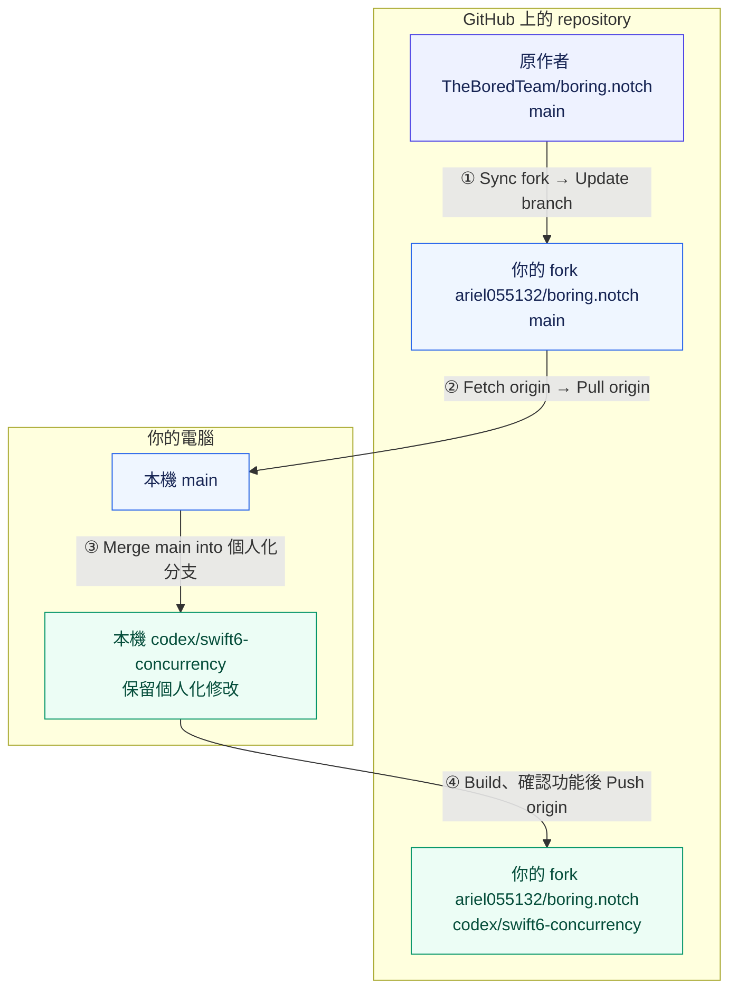
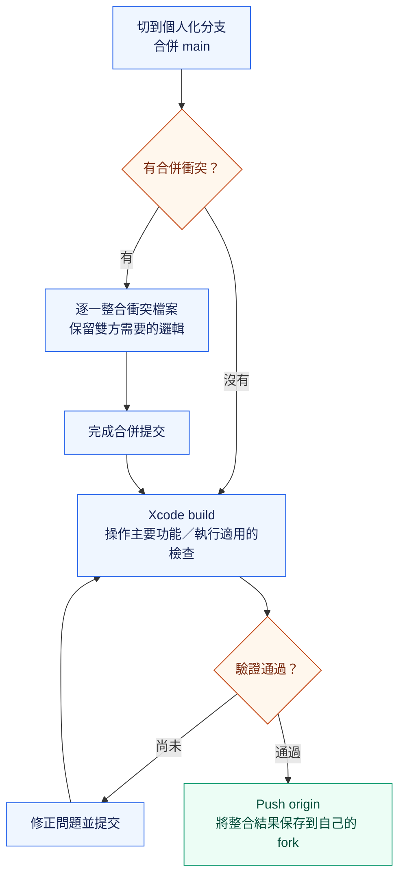

# Boring Notch：同步原作者更新指南

本文件說明如何取得原作者的新版本，同時保留自己的月曆、音樂、天氣與 Swift 6 修改。主要流程使用 GitHub 網頁與 GitHub Desktop，另附終端機操作方式。

整理日期：2026-10-03。以下名稱依目前這份 repo 的設定撰寫；日後若更換帳號或分支，請替換成當時使用的名稱。

## 1. 遠端與分支的分工

| 遠端名稱 | GitHub repository | 用途 |
|---|---|---|
| `upstream` | [TheBoredTeam/boring.notch](https://github.com/TheBoredTeam/boring.notch) | 取得原作者的更新 |
| `origin` | [ariel055132/boring.notch](https://github.com/ariel055132/boring.notch) | 保存、推送自己的版本 |

| 分支 | 建議用途 |
|---|---|
| `main` | 跟隨原作者的 `main`，作為同步更新的基準 |
| `codex/swift6-concurrency` | 個人化版本；新的客製功能繼續在這個分支修改 |

**更新 `main` 不會自動更新個人化分支，還需要把 `main` 合併進 `codex/swift6-concurrency`。**

## 2. 整體流程圖



文字版：原作者 `main` → 你的 fork `main` → 本機 `main` → 本機個人化分支 → GitHub 上的個人化分支。

圖使用 Mermaid；在 GitHub 上開啟本 Markdown 的預覽即可查看。本機編輯器若只顯示程式碼區塊，可使用支援 Mermaid 的 Markdown 預覽，或參照上面的文字版。參考：[GitHub 圖表支援說明](https://docs.github.com/en/get-started/writing-on-github/working-with-advanced-formatting/creating-diagrams)。

## 3. GitHub Desktop 操作步驟

### 步驟 1：先保存手上的修改

在 GitHub Desktop 選擇這個 repository，確認目前位於 `codex/swift6-concurrency`。

- 若 Changes 還有修改，先整理並 Commit，再 Push origin。
- 若其他電腦也修改過這個分支，先 Fetch origin，必要時 Pull origin，讓目前分支與自己的 GitHub 版本同步。
- 開始合併前，確認沒有尚未提交的修改。

### 步驟 2：在 GitHub 同步 fork 的 main

1. 開啟 [ariel055132/boring.notch](https://github.com/ariel055132/boring.notch)。
2. 在網頁的分支選單選擇 **`main`**。
3. 點選 **Sync fork**，檢視原作者新增的 commits。
4. 點選 **Update branch**；若顯示已同步，就直接進入下一步。

這一步更新的是 GitHub 上你自己的 `main`，電腦裡的程式碼還沒有跟著更新。若網頁回報衝突，需先解決衝突；不要把丟棄自己的 commits 當成一般同步操作。

參考：[GitHub 官方同步 fork 說明](https://docs.github.com/en/pull-requests/how-tos/work-with-forks/syncing-a-fork)。

### 步驟 3：把 main 的更新下載到電腦

1. 回到 GitHub Desktop，在 Current Branch 選擇 **`main`**。
2. 按 **Fetch origin** 檢查更新。
3. 有更新時按 **Pull origin**。

完成後，本機 `main` 就包含剛才同步到 fork 的作者更新。

### 步驟 4：合併到個人化分支

1. 切換回 **`codex/swift6-concurrency`**。
2. 開啟分支選單，使用底部的「選擇要合併的分支」功能（英文介面以 **Choose a branch to merge** 開頭）。
3. 選擇 **`main`** 作為合併來源，執行 Merge。

**方向要確認：把 `main` 合併到目前的個人化分支。** 這樣個人化分支會同時包含原作者的新 commits 與自己的修改。

本指南採用一般 Merge，保留已推送的個人化 commit 歷史；不需要為這個流程改用 Rebase 或強制推送。

### 步驟 5：處理衝突並確認功能

若 GitHub Desktop 顯示衝突，開啟對應檔案，整合雙方需要保留的內容，再依 Desktop 提示完成合併提交。特別留意兩邊都改過的：

- `boringNotch.xcodeproj/project.pbxproj`：檔案加入 target、Swift 版本與建置設定。
- `boringNotch/boringNotchApp.swift`、`ContentView.swift`：App 生命週期與畫面接線。
- 月曆、音樂與天氣相關檔案：客製行為與上游功能之間的整合。

即使沒有文字衝突，仍要在 Xcode build，並簡單確認瀏海開合、月曆、音樂封面與播放控制、天氣頁面等功能。文字可以自動合併，不代表執行行為一定相容。

需要定位相關程式碼或執行回歸檢查時，查看 [CODEBASE_MAP.md](CODEBASE_MAP.md)；第 14、15 節記錄 Swift 6 與天氣功能的驗證方式。

### 步驟 6：推送整合後的個人化版本

確認功能正常後，在個人化分支按 **Push origin**。

到 GitHub 切換至 [codex/swift6-concurrency](https://github.com/ariel055132/boring.notch/tree/codex/swift6-concurrency)，即可看到整合後的版本。

參考：[GitHub Desktop 官方分支同步與合併說明](https://docs.github.com/en/desktop/working-with-your-remote-repository-on-github-or-github-enterprise/syncing-your-branch-in-github-desktop)。

## 4. 合併與驗證流程圖



## 5. 終端機替代流程

這是第 3 節的替代做法，不必兩套都執行。前提是手上的修改已 Commit，且 `main` 維持跟隨原作者的用途。所有指令都在這份 repo 的根目錄執行。

先更新本機與 GitHub fork 的 `main`：

```bash
git fetch origin
git fetch upstream

git switch main
git merge --ff-only origin/main
git merge --ff-only upstream/main
git push origin main
```

再把作者更新合併到個人化分支：

```bash
git switch codex/swift6-concurrency
git merge --ff-only origin/codex/swift6-concurrency
git merge main
```

`--ff-only` 在分支歷史已分歧時會停止。若某一步失敗，先確認原因並處理，不要直接繼續往下執行。個人化分支的 `git merge main` 允許產生合併 commit；若有衝突，先解決並完成提交。

完成 Xcode build 與功能確認後，再推送：

```bash
git push origin codex/swift6-concurrency
```

## 6. 確認有沒有同步完成

在個人化分支執行：

```bash
git fetch origin
git status -sb
git log -1 --oneline
git ls-remote --heads origin codex/swift6-concurrency
git rev-parse HEAD
```

- `git status -sb` 沒有檔案變更，且沒有 `ahead`／`behind`，表示本機工作目錄乾淨、已與剛取得的遠端分支同步。
- 最後兩個指令印出的完整 commit 雜湊相同，表示 GitHub 個人化分支已收到本機最新 commit。
- 是否已納入作者更新，可查看合併紀錄；若作者之後又推送新 commit，就在下次更新時再走一次本流程。

## 7. 常用操作的差別

| 操作 | 更新什麼 |
|---|---|
| GitHub 網頁 Sync fork | 將原作者更新同步到 GitHub 上所選的 fork 分支 |
| Fetch origin | 取得自己 fork 的遠端 commits 與分支資訊；不改目前工作檔案 |
| Pull origin | 將自己 fork 的目前分支更新整合到本機 |
| Merge main | 將本機 `main` 的內容整合進目前分支 |
| Push origin | 將本機 commits 上傳到自己的 fork |

日後不需要每次重新 fork 或 clone。繼續使用既有 repository，定期同步 `main`，再合併到個人化分支即可。
